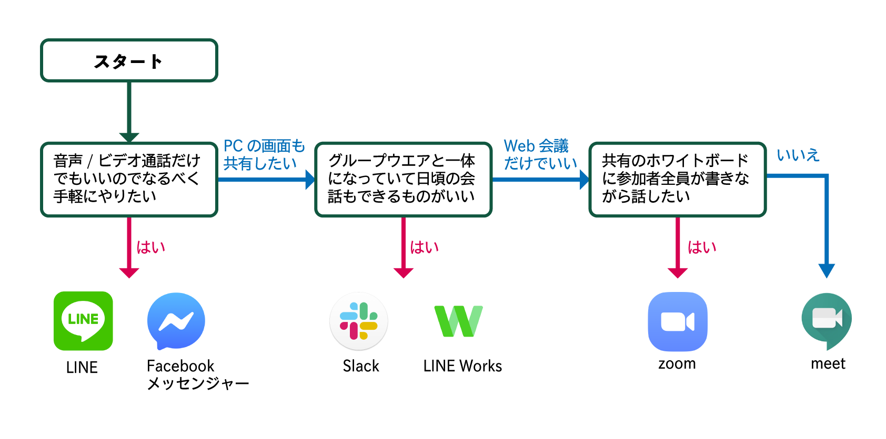

# どの会議ツールを選んだらいいの？
会議ツールはビデオ通話ができるだけのものから画面共有やグループウエアと一体になっているものまで多種多様です。この記事では数多くの会議ツールの中からあなたにピッタリのツールをご紹介します。

# 各ツールの比較

|ツール名|価格|備考||
|---|---|---|---|
|LINE|無料||[使い方(執筆中)]() |
|Facebookメッセンジャー|無料||[使い方(執筆中)]() |
|Slack|一部無料|無料プランではグループ通話不可|[使い方(執筆中)]() |
|LINE Works|無料||[使い方(執筆中)]() |
|Zoom|一部無料|無料プランではグループ通話は1回40分限定|[使い方](zoom/ZoomMeeting.md) |
|Meet|一部無料(※)|日本連盟では[デジタルツール配布プログラム](https://www.scout.or.jp/member/digital_tool_program/)としてmeetを含めたG Suiteアカウント提供をしており、有償版のMeetが無償にてご利用頂けます。 一般のGoogleアカウントでもMeetが利用できるようになりました。制限がありますが無償にてご利用頂けます。|[使い方](https://sites.google.com/scout.jp/meet)|

※各メーカーから提供されるアプリなどはセキュリティ対策として常に最新版を使うようにしてください。