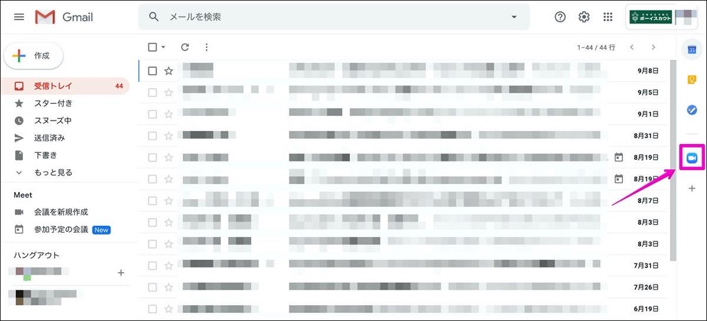

#### [よくある質問](../index.md) > Gmailよくある質問

DX小委員会へよく寄せられるGmailに関する質問と回答(解決法)をご紹介します。

## Zoomのアイコンは何ですか？

このアイコンはGmailとZoomを連携させるアドオンです。日本連盟から**Zoomのアカウント付与はしておりません**のでご注意ください。

お持ちのZoomアカウントと連携でき、ミーティングへの参加、開設、設定などが簡単にできるようになります。Zoomは無償版、有償版のどちらとも連携が可能です。

アイコンをクリックすると `Sing in` と表示されますのでお持ちのアカウントでログインしてください。