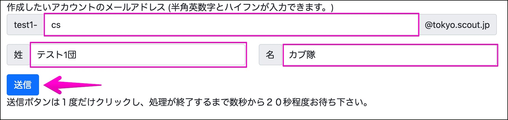
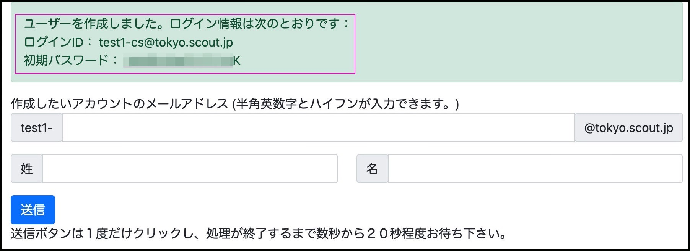
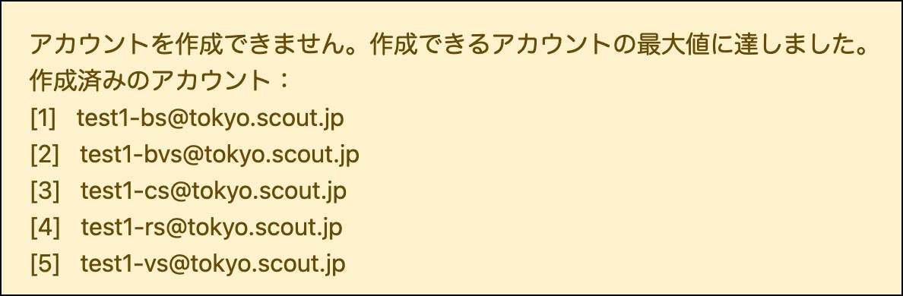
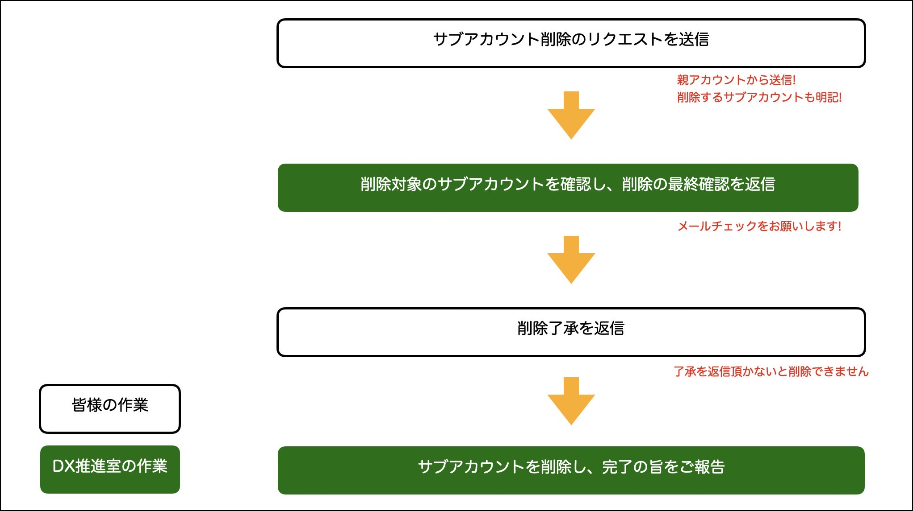

2021/03/10 更新

## サブアカウントの追加方法

[デジタルツール配布プログラム](https://www.scout.or.jp/member/digital_tool_program/)で配布しているアカウントにサブアカウントを追加する方法をご紹介します。

### サブアカウントでできること

発行済みのアカウントを`親アカウント`として、複数の `子アカウント`を作り運用方法を拡張することができます。 
例えば1つのアカウントを共有することなく、各隊でMeetを開催ができるようになります。

### 追加条件

- 団および地区のアカウントが対象です(デジタルツール配布プログラム対象外県連は一部対象外)
- 1つの親アカウントに対して **最大5つ** のサブアカウントの追加が可能です(団内で運用形態をよくご検討のうえ設定をお願いします)
- サブアカウントの利用者も [デジタルツール配布プログラム利用規約](https://docs.google.com/document/u/2/d/e/2PACX-1vTgWKAjFIb0YqrtzVmrn7g-Fek3d13IJCZ9uoYrrtQ31qCHwS5EPJoxIBBq7nsrG3_FLx95qxkvljHI/pub) を遵守していただきますようお願い致します。

## 作成方法

1. [デジタルツール配布プログラム](https://www.scout.or.jp/member/digital_tool_program/)で配布しているアカウントにログインする

2. [サブアカウント作成フォーム](https://script.google.com/a/macros/scout.jp/s/AKfycbyWtkZ8cpPoO_3P_p5btKYen3MqfVJ_5qsMW1ZvKcuLd5ZMBt2pkcm2JQ/exec)にアクセスする
   
    - 作成したいアカウントのメールアドレスを入力する 
(親アカウントが `test1@tokyo.scout.jp`の場合、`test1-{something}@tokyo.scout.jp` の形式になります)

	- 姓と名を入力する
	
    
    
3. `送信` をクリックし、**20秒ほど待ちます。**

4. アカウントが作成されるとこのようにメッセージが表示されるので、ログインIDと初期パスワードを忘れずにメモしてください。(一度パスワードが表示されている画面から離れると二度とパスワードが確認できなくなります) 
    他のサブアカウントを続けて作成したい場合は同じようにフォームに入力をして作成してください。

    
    
5. サブアカウントの作成上限(5個)に達した場合はこのようにエラーが表示され、作成することができません。
    

## サブアカウントに関するFAQ
- なぜサブアカウントの上限が５個なのですか？ 
　親アカウントを団全体に、子アカウントをビーバ〜ローバーまでの５隊にそれぞれ割り振ることを想定しています。これはあくまで想定なので、５アカウントまでであればどのような形で割り当てていただいても構いません。

- 親アカウントと子アカウントの違いはなんですか？ 
使用できるアプリケーションや機能的な違いはありませんが以下のような違いがあります。
    - 子アカウントは親アカウントに付与されている「共有ドライブ」が付与されません。親アカウントの共有ドライブを使用してください。共有ドライブに子アカウントを追加するには親アカウントにログインして共有ドライブのユーザーに子アカウントを追加します。
    - 子アカウントのプロフィール項目「直属の上司」に親アカウントが指定されています。

## サブアカウントの削除
作成したサブアカウントを削除したい場合は [DX推進室](mailto:dx@scout.or.jp)までメールでお問い合わせください。
- 削除リクエストのメールは親アカウントのメールから送信してください。（本人確認のため）
- 削除したいメールアドレスを明記してください（誤削除防止のため）
- 確認作業のため、フロー図のようにメールでのやりとりが必要となります。親アカウントでのメールチェックをお願い致します。
