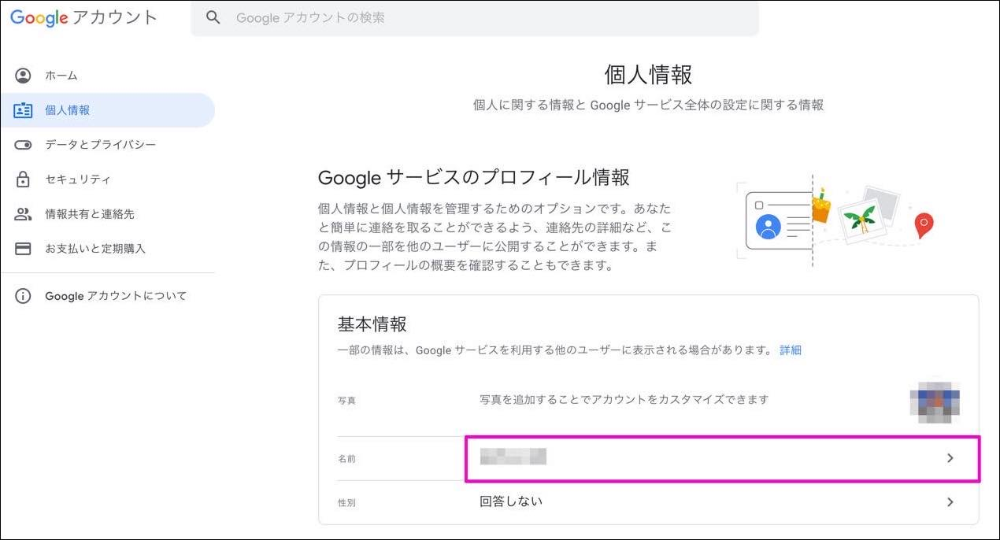
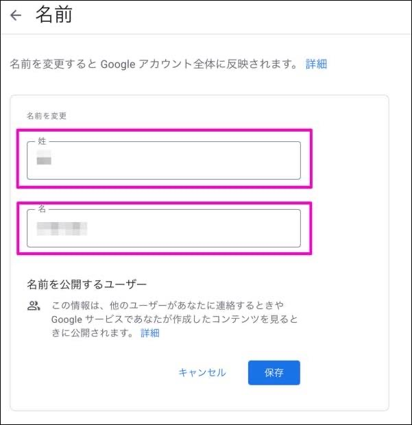

---

title: Googleアカウントの表示名を変更する方法

---

日本連盟から配布しているアカウントにログインしてから[Googleアカウント](https://myaccount.google.com/)にアクセスします。

`個人情報` をクリックし、続けて `名前` をクリックします。(名前の部分には現在設定されている名称が表示されています)

ここで一端パスワードの入力が求められる場合があるので、アカウントに設定しているパスワードを入力して下さい。

次の画面で`姓`と`名`を入力し、`保存`をクリックすると反映がされます。

