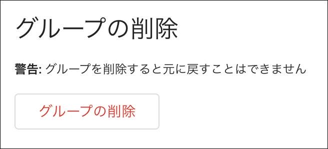

[Googleグループ](https://groups.google.com/)の機能を使って一般的な機能のメーリングリストを作成する方法をご紹介します。

### メーリングリストでできること

予め登録してあるメンバーに対して一斉に同報メールを送信することができます。

## 作成方法

1. [デジタルツール配布プログラム](https://www.scout.or.jp/member/digital_tool_program/){:target="_blank" :rel="noreferrer"}で配布しているアカウントにログインする
2. [Googleグループ](https://groups.google.com/)にアクセスする

以下の手順で作成を行って下さい。(以下の解説で出てくるメールアドレスなどは架空のものです)

`グループの作成` をクリックする

- グループ名: 任意のグループ名を入力します。

- グループメール: 使用するメールアドレスを決めます。アドレスに団名を入れるなど、他の団と絶対に重複しないアドレスをしてください。 `-group`は必ず入ります。

- グループの説明: 任意で説明文を入力して下さい。

ここまで入力できたら `次へ` をクリックします。

この画面では図のような設定のままでOKです。

この画面では `グループメンバー` `グループのマネージャー`はブランクでOKです。

ウェルカムメッセージは任意のものを入力して　`グループを作成`をクリックします。

これでグループが作成できました。マーカー部がメーリングリストで使用するメールアドレスになります。

`グループの設定` > `外部メンバーも許可する` を`オン`に変更します。(これでgoogleユーザー以外のメールアドレスを使用している方も登録できるようになるので必ず行って下さい)

そのまま画面を下方にスクロールします。

`グループのメールの言語`を`Japanese`に変更します。(任意でOKです)

更に下方に進みます。

`返信の投稿先`を`グループのメンバー全員`に変更します。

これまでの設定を保存します。

続けて`メンバー`をクリックして、`メンバーの追加`をクリックします。

`グループメンバー`に登録したい方のメールアドレスを列挙します。

入力が終わったら `メンバーを追加` をクリックします。

これでメンバーの登録が完了しました。グループのメールアドレスにメールを送信すると、ここで登録したメンバーに一斉にメールが配信されるようになります。

## メンバーを削除する

メンバーのリストで削除したいメンバーにチェックを入れ、削除ボタンを押すとメンバーから削除することができます。

## グループを削除する

`グループ設定`の最下部に削除ボタンがあります。

グループを削除する場合はこのボタンをクリックして下さい。