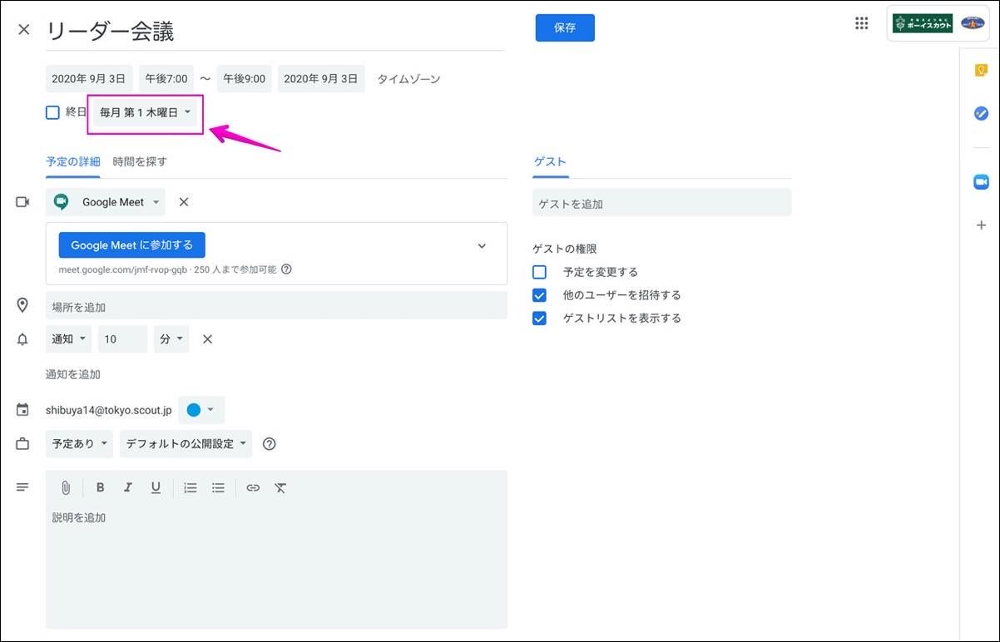

[よくある質問](../index.md) > Google Meet よくある質問

## 団以外のアカウントを発行して欲しい
2020年9月1日より各団と地区に対してアカウントを発行しております。[プログラムの利用申請](https://www.scout.or.jp/member/digital_tool_program/)

スカウト活動を目的としたものならばお使い頂けますのでご活用下さい。

---

## 同時に複数の会議を開催したい

同時に複数の会議を開催することが可能です。

(例) 同時刻に部門別の円卓を開催する場合など

【会議の設定方法】

1. Google WorkspaceのアカウントでログインしGoogleカレンダーにアクセスします
2. カレンダーに会議の予定を設定します(例: ビーバー部門円卓、カブ部門円卓、ボーイ部門円卓が同時に開催されるとしたら3つの会議予定が同時刻に並ぶことになります)
3. それぞれの会議案内のアドレス(URL)を参加者に通知します

[カレンダーからの会議設定の方法](../../web-meeting-guide/meet/GoogleMeet-calendar.md)を参照してください。

【お薦めの方法】

例えば4部門の円卓を同時開催する場合、4名の会議主催者を置くことをお薦めします。(4名の主催者がそれぞれ会議を設定)

!!! warning "【注意!!】"

	主催者が1名で同時刻の会議を開催することもできますが、都度の参加承認や各会議室のモデレート(管理)など、高度な操作が必要となります。また一人で複数の会議を主催、管理する場合は複数のタブを開く必要があり、カメラ映像の負荷でパソコンの動作が重くなったり、音声が混線して会議進行に支障が出る恐れがあります。

---

## 「相手に音声が届かない」または「相手の声が聞こえない」

まずお使いの端末(パソコンやタブレット)にカメラ、マイクが付いていることを確認してください。もし端末に備え付けのカメラ・マイクが無い場合は外付けのものをご購入いただく必要があります。

【カメラ・マイクが付いている場合】

Meetの設定画面でご使用のカメラまたはマイクが選択肢に出ているか、別のものが選択されていないか確認してください。

もし選択肢に出てこない場合は故障の疑いがあるため、メーカーにサポートを依頼してください。お使いのパソコンのOSバージョンにも対応しているものか確認もしてみて下さい。

【Meetでの設定の仕方】

ミーティング開始前であれば、[https://meet.google.com](https://meet.google.com/) にアクセスし、画面上部の歯車マークをクリックします。

- 「音声」タブでは使用するマイクとスピーカーを選択します。
- 「動画」タブでは使用するカメラを選択します。

ここに使用する機材の選択肢が無い場合はブラウザを再起動する、パソコンを再起動する、使用する機材の電源を入れ直してみるなどしてみたくざい。

ミーティング開始後であっても画面右下の設定アイコンから同様の設定を行うことができます。

---

## 参加者もGmailのアカウントが必要？

【Gmailアカウントが必要な場合】

スマートフォンやタブレットなどでMeetアプリから参加する場合は必要となります。

それ以外の場合、参加者(ゲストユーザー)はGmailのアカウントは必要ありません。

招待状を受け取ったら氏名を入力して [参加をリクエスト] すればOKです。(特にメールアドレスを入力する必要もありません)

Meet会議の主催者は必ずGoogle Workspaceのアカウント(日本連盟から発行のもの)でログインする必要があります。

---

## 主催者の承認なしに会議へ参加する方法

通常だと会議への参加は主催者の承認が必要ですが、Gmailを使用する事で主催者の承認なしに会議へ参加することができます。

### 条件

参加者がGmailのアカウントを持っていて、かつGoogle(ブラウザもしくはアプリ)に同一アカウントでログインしていること

例) hoge@gmail.com 宛に招待状を送ってもらう かつ Gmailにhoge@gmail.comでログインしている状態

### 方法

1. 主催者から参加者のGmail宛に招待状を送る(2通りの方法があります)

 - [カレンダーから招待状を送る](../../web-meeting-guide/meet/GoogleMeet-calendar.md)
 - [会議開始直後、または会議開催中に送る](../../web-meeting-guide/meet/GoogleMeet.md)

2. 参加者がGmailで招待状を開き、[ミーティングに参加]をクリックする

 - ブラウザまたはアプリで [今すぐ参加] をクリックする

これで主催者の承認手続きなしに会議へ参加できます。

参加者がGmail以外の場合は主催者の承認が必要となります。

---

## 参加者の映像を並べて表示したい

Meetの公式機能としてタイル表示レイアウトを導入し、最大16人を同時表示可能になりました。
2020年4月23日から実装が開始されており、順次適用されます。

[公式リリース](https://cloud.google.com/blog/products/productivity-collaboration/introducing-tiled-view-and-other-top-requested-features-in-google-meet)(英語)

---

## ダイヤルインの電話番号について

`スマートフォンで参加する場合は、+1 318-xxx-xxxx とダイヤルし、PIN（000 000 000#）を入力してください`

このようにダイヤルインの電話番号が使用可能になります。これはアメリカへの通話料が発生しますのでご注意ください。

日本国内の番号には対応しておりません。

---

## 予定している会議が表示されない
Meetで会議予定を設定しスマホなどのアプリで「今後の会議」を表示した場合、「今日」または「明日」に予定されている会議しか表示されません。(明後日以降の会議は表示されません)

---

## ブラウザEdgeで「Meetはご利用のブラウザには対応していません」と表示される
このようなメッセージが表示されるということは動作推奨のバージョンから大きく異なっている可能性があるため、画面指示に従って最新版をインストールしてMeetをお試し下さい。

参考: 2021年7月8日現在のEdge最新バージョンは91.0.864です。

!!! tip "【Microsoft Edgeのバージョンを確認する】"

	- Microsoft Edgeを起動します。
	- 右上の[ 他の操作 ]ボタンをクリックします。
	- メニューが表示されますので、[ 設定 ] をクリックします。
	- 設定メニューが表示されますので、下部までスクロールします。
	-  「このアプリについて」にバージョンが表示されていることを確認します。

---

## 一般向けMeetとGoogle Workspace版Meetの違い
2020年5月1日にMeetが一般ユーザー向けに解放されました。

主に以下の機能の違いがあります。

!!! Tip	"主な機能の比較"

	|機能|無償版|日本連盟版|
	|---|---|---|
	|1対1通話|24時間|24時間|
	|3人以上の通話|1時間 （2021年6月28日までは 24時間）|24時間|
	|参加人数|100人|100人|
	|画面共有|〇|〇|
	|会議の録画|×|〇|
	|挙手|×|〇|
	|ホワイトボード|×|〇|
	|Googleアカウント以外の参加|×|〇|
	|ブレイクアウトルーム|×|×|

日本連盟から提供しているMeetアカウントは[Google Workspace版(Education Fundamentals)](https://edu.google.com/intl/ja_ALL/products/workspace-for-education/editions/)のものになります。

---

## 主催者を変更したい

予定していた会議の主催者が参加できなくなった場合は主催者を変更する必要があります。以下の手順で変更ができます。

(1)予定のオプションメニューから `主催者を変更` をクリックします。

(2)`新しい主催者` には新しい主催者のgmailアドレスを入力します。(Googleアカウントが必須です)

`メッセージ`は任意のものに変更が可能です。`主催者を変更` をクリックすると新しい主催者に確認のメールが送信されます。

(3)新しい主催者はこのようなメールを受信します。受け入れる場合はメールにあるURLをクリックします。

クリックするとGoogleカレンダーに画面が切り替わり、旧主催者が設定したミーティング情報がカレンダー上に表示されます。(この時点で旧主催者のカレンダーからはミーティングの予定が削除され、主催者が切り替わります)

これで主催者の切り替えができました。

なお、主催者の変更をした場合でもMeetのURL(ミーティングコード)は変更されないため、参加者への再通知は不要です。

### 主催者を変更する際の注意

!!! warning "主催者を変更する際の注意"
	無償版のGoogleユーザーに主催者を変更した場合、ミーティングの機能制限が発生します。(変更先のアカウント種類に依存します)

	(例)

	- 主催者が日本連盟発行のアカウントでミーティングを設定し、その後無償版のGoogleユーザーに主催者を変更した

		- この場合、ミーティングの参加人数が100人、また最大60分まで(2020年9月30日までは300分)の制限が発生します

---

## 毎回同じURL(ミーティングコード)を使いたい

ミーティングのURL(ミーティングコード)は発行する度に変わるので、毎回の通知が必要になりますが、一度発行したURLは90日間使用する事ができます。

[同じリンク/ダイヤルインコードを使用して定期的な会議を開くことはできますか？](https://support.google.com/meet/thread/37248056?hl=en)(英語)

この記事によると発行したURLは90日間使われないと破棄されるとのことなので、90日経過前に再利用することで使い続けることができるようです。(こちらで確認したところ、一週間の内に何度も同じURLでミーティングを開催することができました)

### 定期的なミーティングを設定する

同じURLを使用する方法としては `繰り返しの予定` として設定する方法があります。

Googleカレンダーでミーティングの予定を設定するときに、このように`繰り返しの予定`として設定することで、毎回同じURLで開催することができます。

繰り返しの頻度はカスタマイズできますので、ご希望に添ったものを選択してください。