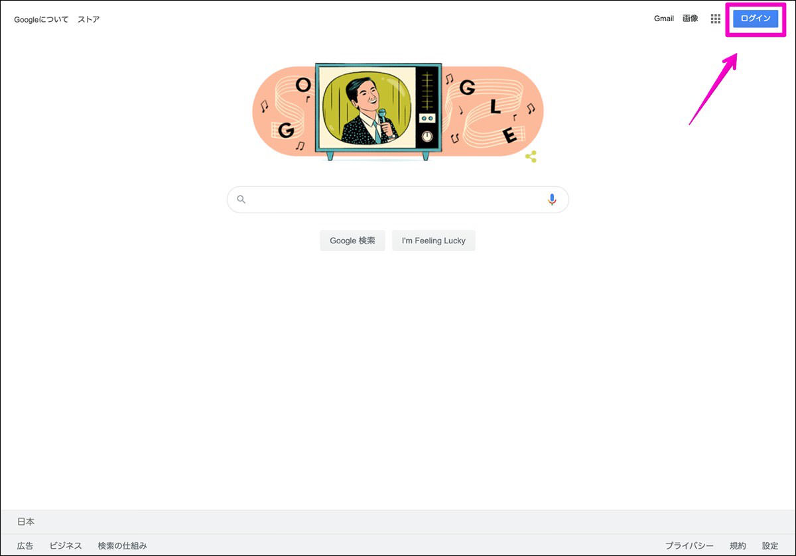
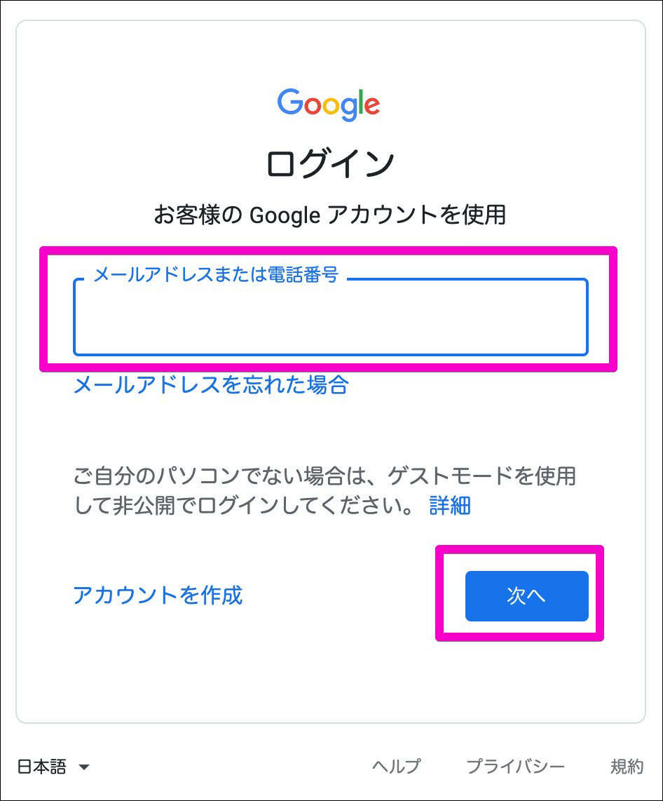
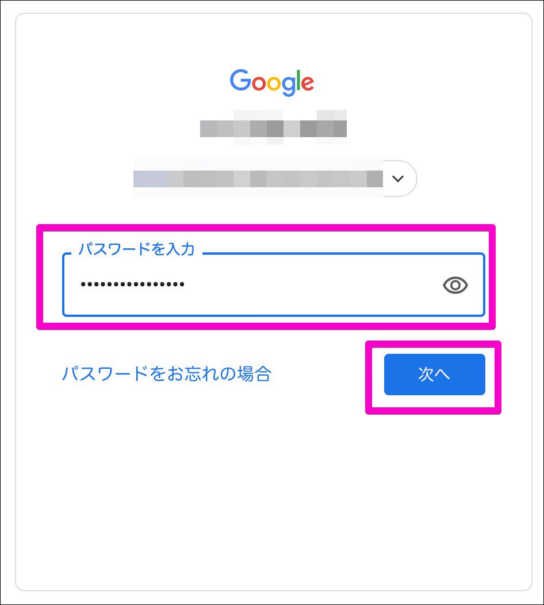
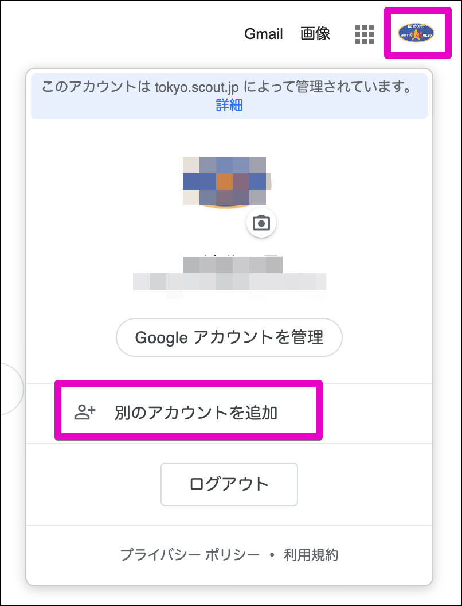
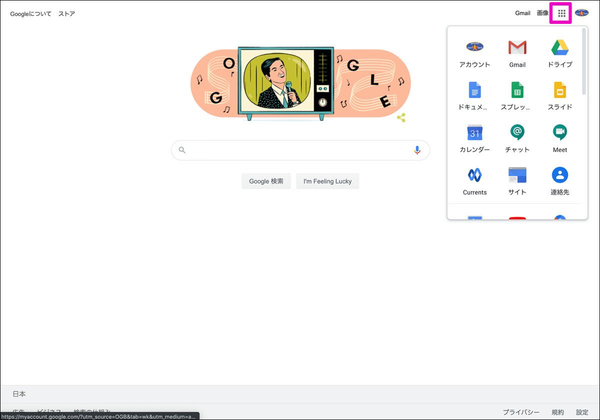

Google Workspaceへのログイン方法と各アプリの呼び出し方法をご紹介します。

## ログインする

1. ブラウザから [https://www.google.com](https://www.google.com){:target="_blank" :rel="noreferrer"}にアクセスし、右上の `ログイン` をクリックします。
   

2. 枠内に日本連盟から発行されたアカウント(xxxx@\*\*\*\*.scout.jp, xxxxは団・地区の英語表記、\*\*\*\*は都道府県の英語表記)のメールアドレスを入力して、`次へ`をクリックします。
   

3. パスワードを入力して `次へ` をクリックしてログインします。
   

4. 既に別のGoogleアカウントでログインしている場合はこのように右上のアイコンをクリックし `別のアカウントを追加` からアカウントを追加してください。 
   ブラウザ上では複数のGoogleアカウントでログインをしていることになりますので、どのアカウントで作業をするかよく確認することが必要です。
   

## 各アプリを呼び出す

ログイン後、右上のアイコンをクリックしパネルを展開します。 
ここから各アプリを呼び出します。

## 万が一パスワードを紛失してしまった場合
日本連盟から発行しているGoogle Workspaceの親アカウントもしくはサブアカウントのパスワードを紛失した場合は以下の「パスワード再設定申請フォーム」にて必要事項を記入し申請をしてください。 
１～２営業日以内にご連絡を頂いた方にメールでご返答します。 

[パスワード再設定申請フォーム](https://forms.gle/99wLRaGtrZoYnhkY7){:target="_blank" :rel="noreferrer"}
