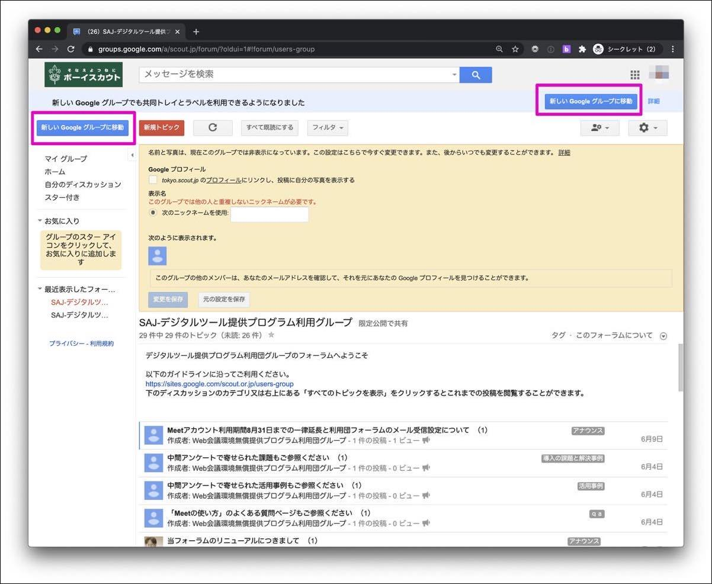
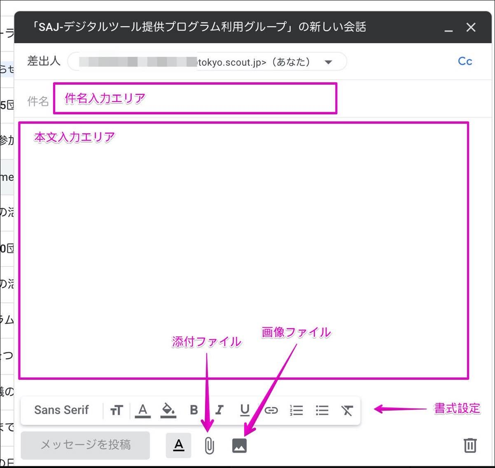
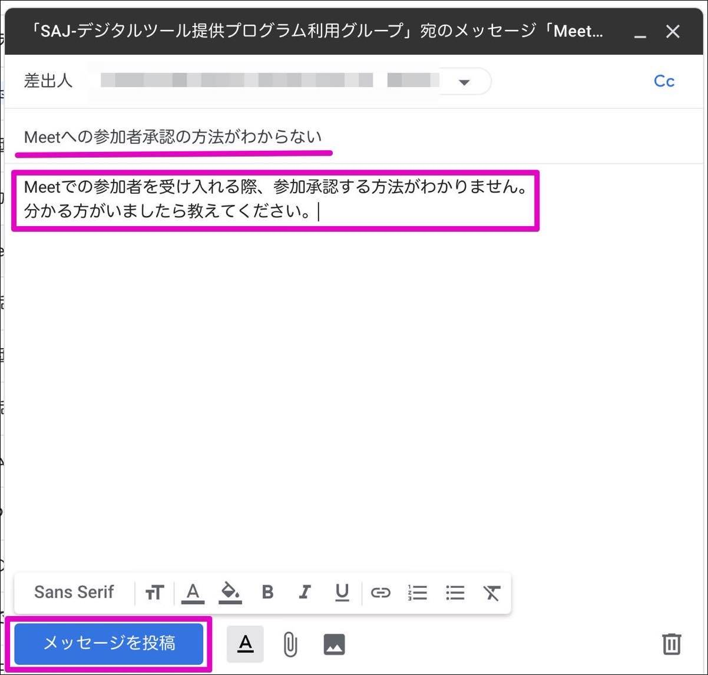
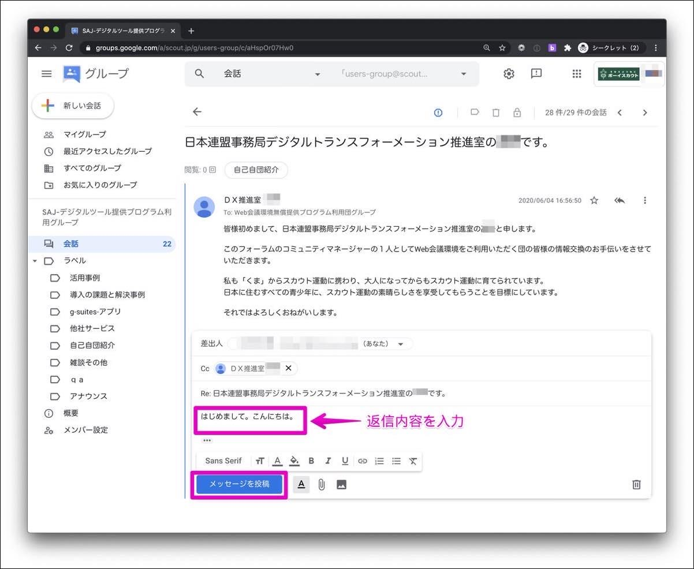
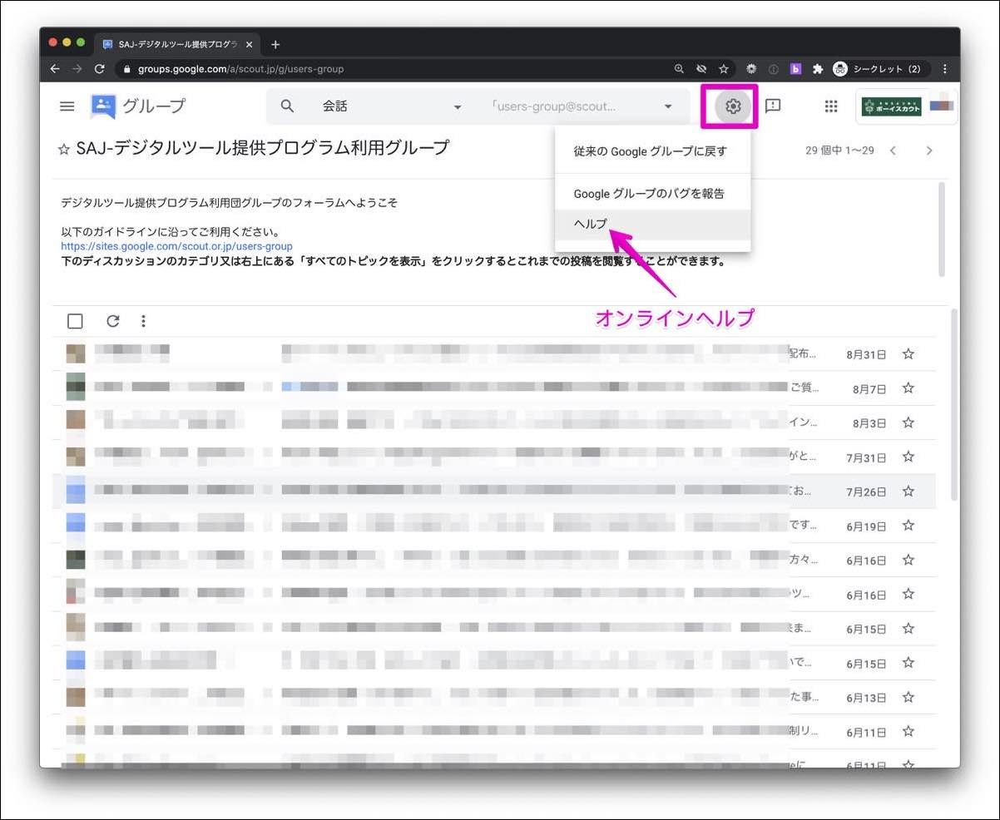

# デジタルツール提供プログラム利用グループフォーラム 使い方ガイド

## 専用フォーラムにアクセスする

[SAJ-デジタルツール提供プログラム利用グループ](https://groups.google.com/u/0/a/scout.jp/g/users-group)にアクセスします。 
フォーラムを閲覧、書き込みをするには日本連盟より発行しているアカウントにログインしている必要があります。 
プライベートで使用しているGoogleのアカウントと併用している場合、フォーラムにアクセスする場合は日本連盟から発行しているアカウントに切り替える必要があります。 
アカウントが不明な場合は `アカウント発行通知メール` をご確認ください。

フォーラムにアクセスするとこのような画面になります。

もしこのような画面になった場合は、左上または右上の `新しいGoogleグループに移動` をクリックして画面の切り替えを行ってください。 
カテゴリー機能の廃止により、従来の表示形式では不具合が出るため必ず表示を `新しいGoogleグループ` に切り替えをしてください。

### 新しい会話を始める方法

新しい会話(新規の書き込み)を始めるには、画面左上の `新しい会話` をクリックします。 
何かの話題について会話を継続する場合は [返信機能](#返信する)を使うようにしてください。

入力エリアが現れますので、件名と本文を入力します。 
書式や添付ファイル、画像の添付なども可能です。サポートを要請する時には画像があると分かりやすいので適宜ご利用ください。

件名と本文を入力すると、`メッセージを投稿` ボタンが押せるようになります。

### 返信する
誰かの投稿に返信するケースをご紹介します。 
何かの話題について会話を継続する場合にはこの返信機能を使うと他の人にも分かりやすいです。 
話題が変わったり、全く新規のテーマとして会話を開始したい場合は [新しい会話を始める方法](#新しい会話を始める方法) がベターです。

返信をしたい記事をクリックすると、このように表示が切り替わります。 
下部の `全員に返信` をクリックします。

返信内容を入力すると `メッセージを投稿` ボタンが押せるようになります。 
新規メッセージと同じ要領で書式や添付ファイルなども使うことができます。

### メンバー設定

左メニューの `メンバー設定` をクリックするとこのような画面になります。 

- 表示名: 他のユーザーから認識しやすいお名前を設定してください。
- 定期購入: 定期購読の誤訳と思われます。このフォーラムにメッセージが投稿されると通知されるメールの頻度を希望に応じて変更してください。 
設定を変更したら `変更を保存` ボタンをクリックします。

### オンラインヘルプ
画面上の歯車マークをクリックしてヘルプを呼び出すと、オンラインヘルプを呼び出すことができます。 
Google公式のフォーラムの使い方が確認できますので、当ガイドでは紹介していない詳細などを参照頂けます。

### ラベル機能

旧フォーラムでの `カテゴリ`機能が廃止されたため、`共有ラベル` を使って記事の分類をすることになりました。 
左メニューの `ラベル` をクリックすると設定済みのラベルが表示されます。 
ラベルの貼り付けなどは管理者側で随時行うため、ユーザーの皆様には操作頂く必要はありません。