# リモートデスクトップを使ってみよう
「パソコンの調子が悪い!」「設定が分からないから教えて欲しい!」など困ることってありますよね。

そんな時に便利なのが「リモートデスクトップ」機能です。

これを使えば遠隔地のパソコンを操作ができるので遠隔サポートを頼んだり、自宅にあるパソコンに対して外出先からソフトの実行やファイルの閲覧などをすることが出来ます。

## リモートデスクトップって何?
リモート デスクトップを使うと、パソコンやモバイル デバイスからインターネット経由で、他のパソコンにあるファイルやアプリケーションにアクセスできます。
### こんなことに使えます
* 「パソコンのトラブル発生! ちょっと助けて欲しい!」
* 遠隔地のパソコンを操作したい

などなど

## どれを使えば良い?お薦めは?
パソコンを遠隔で操作するリモートデスクトップのアプリケーションは多数存在しますが、今回は設定も簡単でOSを問わずに使用する事ができる**Chromeリモートデスクトップ**をご紹介します。

## Chromeリモートデスクトップを使ってみよう
**Chrome リモート デスクトップ**を使うとインターネットを介して他のパソコンにアクセスすることができます。

### Chromeリモートデスクトップの動作条件
* インターネットに接続されていること
* Googleアカウントにログインしていること
* Windows10の場合Sモードを解除していること (解除していないとChromeのインストールができません) [Windows 10 の S モードを解除する](https://support.microsoft.com/ja-jp/help/4456067/windows-10-switch-out-of-s-mode)

### GoogleChromeのインストール
パソコンにGoogle Chromeがインストールされていない場合は[ここ](https://www.google.com/intl/ja_jp/chrome/)にアクセスしてGoogle Chromeをインストールしてください。

### リモートアクセスの設定
インストールしたGoogle Chromeを起動して、アドレスバーに`remotedesktop.google.com/access`と入力してEnterキーを押します。

#### アプリケーションのダウンロード
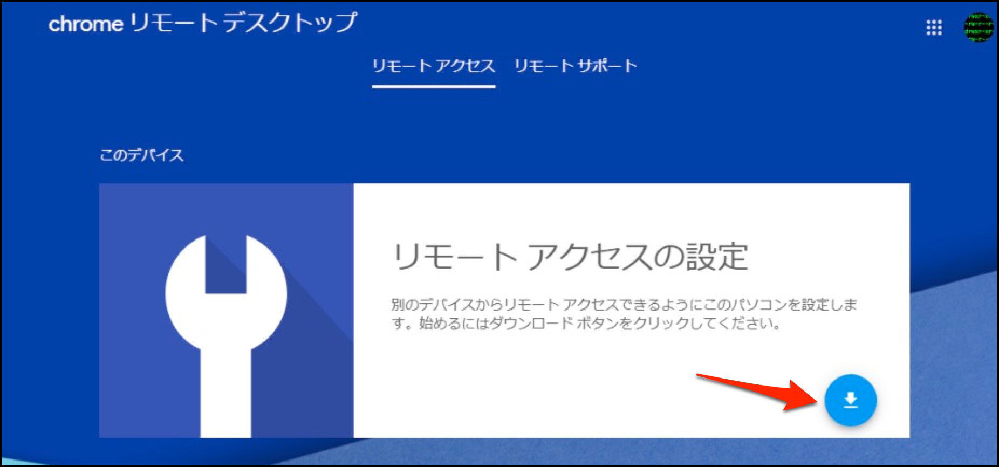

このような画面になるのでアイコンをクリックしてアプリケーションをダウンロードします。

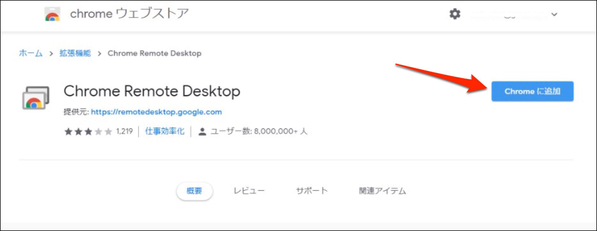

別画面がポップアップするので[Chromeに追加]をクリックします。

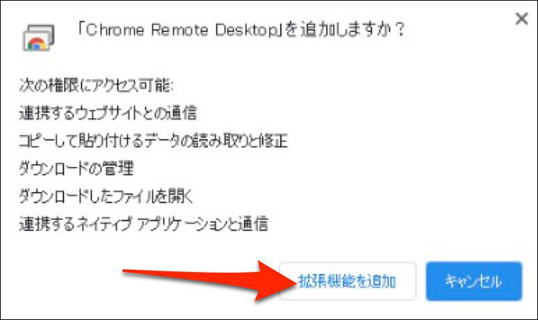

[拡張機能を追加]をクリックします。

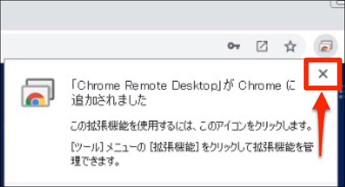

拡張機能がインストールされたら×でウィンドウを閉じます。

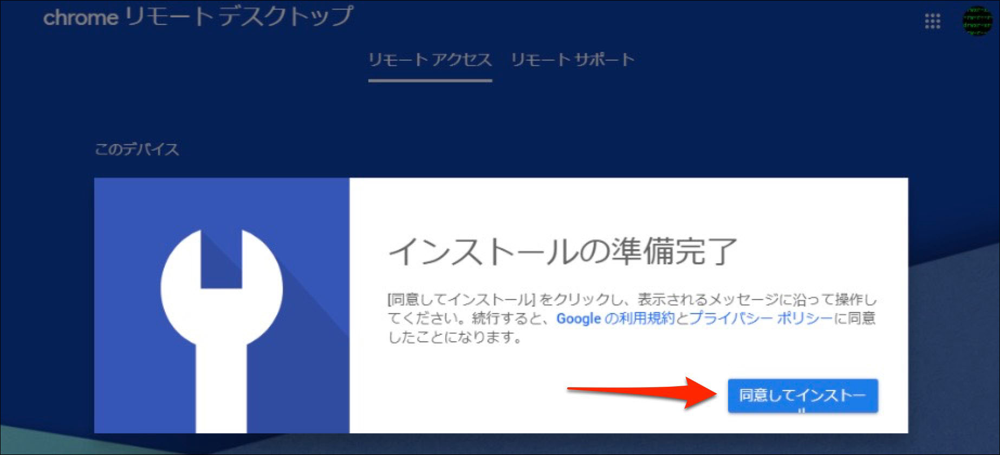
元の画面に戻ったら「同意してインストール」をクリックします。

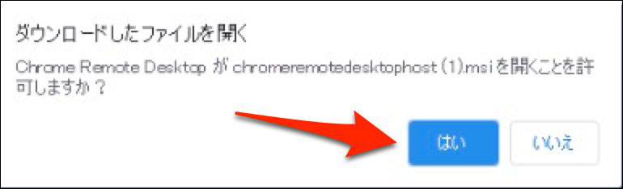

ダウンロードが完了するとこのようなウィンドウがポップアップするので「はい」をクリックします。

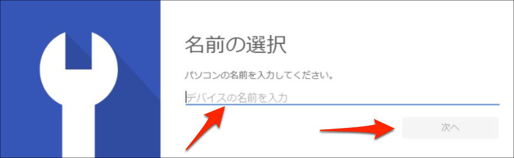

インストールの途中でこのような画面になります。使用しているパソコンの名前が予め入力されているかもしれませんが、判別しやすいように好きな名前に変更が可能です。

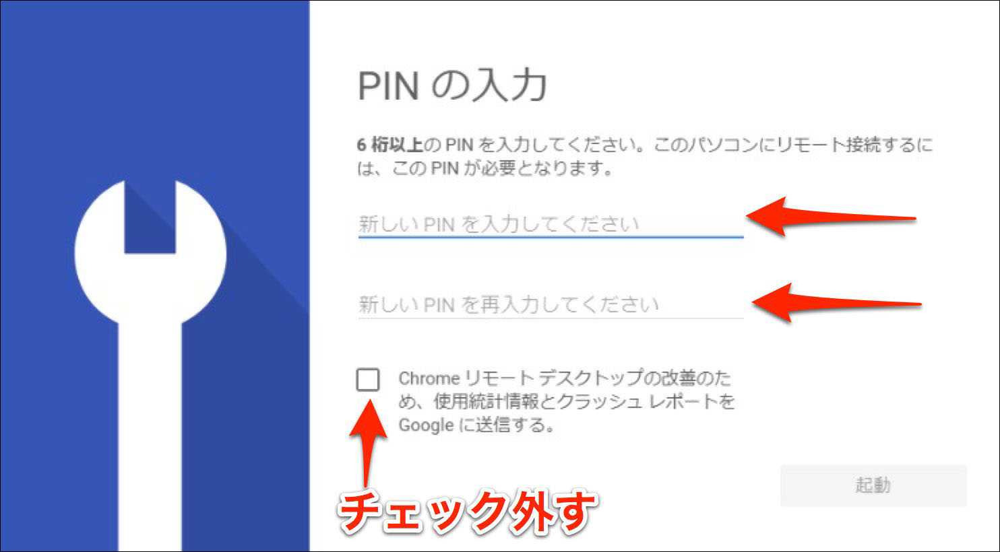

遠隔地からパソコンを操作する際に必要なPINコードを設定します。この番号は重要なので必ずメモを控えるようにしてください。
図中のチェックを外して[起動]をクリックします。

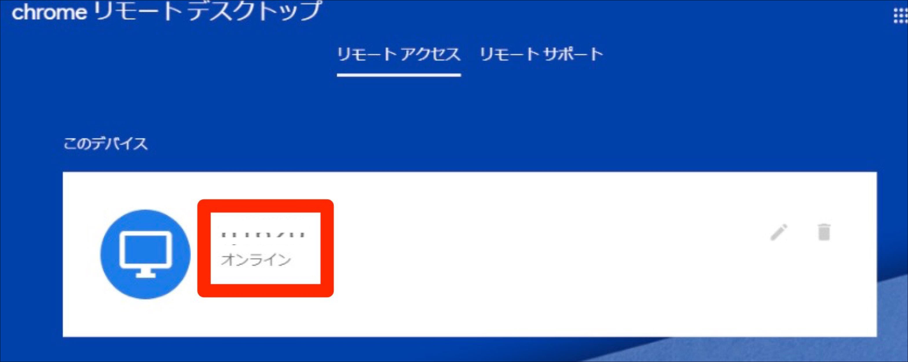

画面が切り替わります。ここには先程設定したパソコンの名前が表示され、"起動しています..."と状態が表示されます。少し経っても「オンライン」にならなければページを再読込してみてください。

### サポートを受けるとき
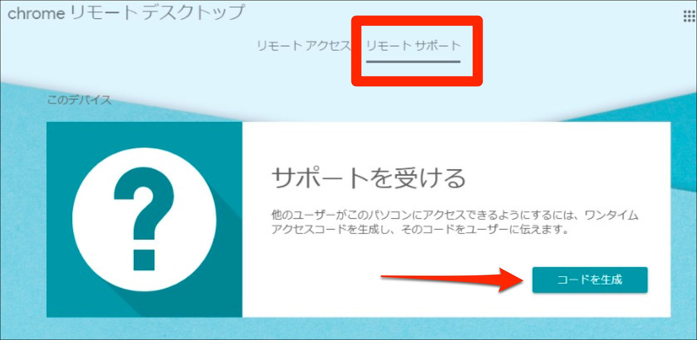

chromeで[ここ](https://remotedesktop.google.com/support)にアクセスして、図中の[コードを生成]をクリックします。
*サポート相手と事前に連絡を取り、お互いに同時間帯にPCの前で操作できる状態になっている必要があります。またパソコンを遠隔で操作する権限を与えるため、信頼できる人にお願いしましょう!*

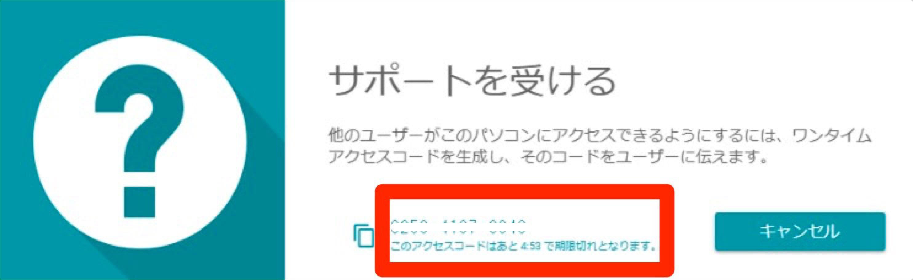

このように12桁の数字が表示されます。この12桁の数字をサポートをしてくれる相手に伝えます。(電話やメールなどでOKです)

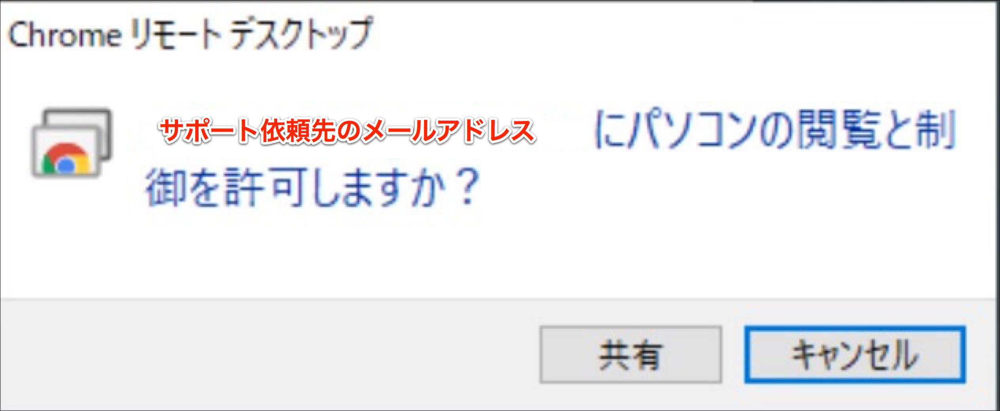

連絡を受けたサポート相手が12桁の番号を入力すると、このような確認メッセージが表示されるので[共有]をクリックします。(第三者に12桁の番号を知られないように注意!)

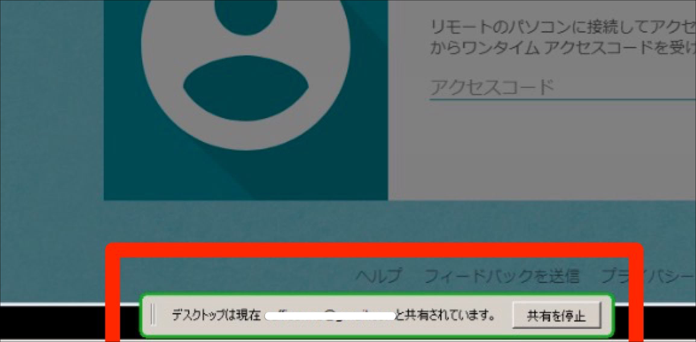

画面の共有中は画面下部にこのようなメッセージが表示されます。遠隔サポートが終わったら[共有を停止]をクリックして接続を解除します。

### 遠隔地のパソコンにアクセスする
#### 遠隔地のパソコンにアクセス
[ここ](https://remotedesktop.google.com/)にアクセスして[リモートアクセス]をクリックします。

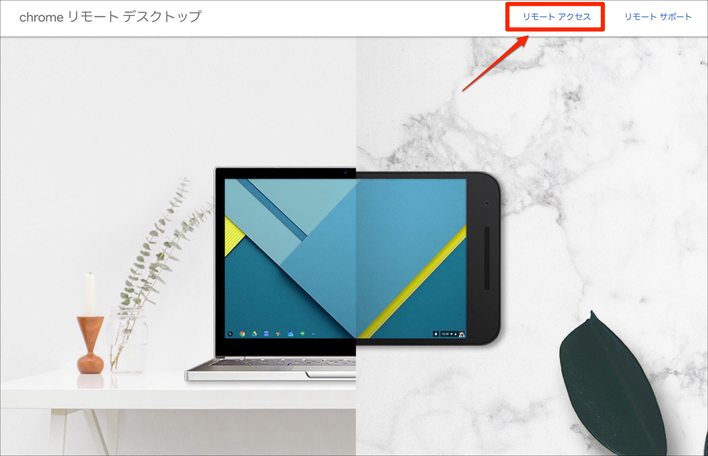

#### アクセス可能なPC一覧
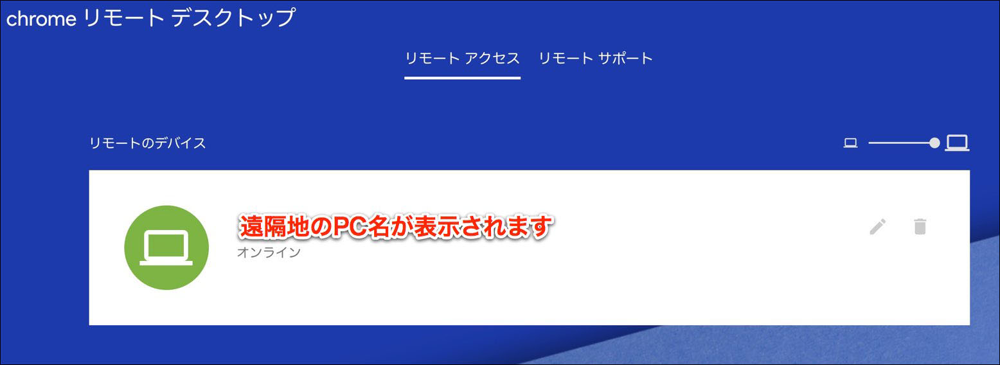
このようにリモート操作が可能なPCの一覧が表示されます。

#### 一覧にPCが表示されない場合
リモート操作をする側とされる側のPCで同じGoogleアカウントにログインしている必要がありあます。一覧に表示されていても`オフライン`となっている場合は電源が入っていないか、ネットワークに接続されていないため使用する事ができません。

#### PINコードの入力
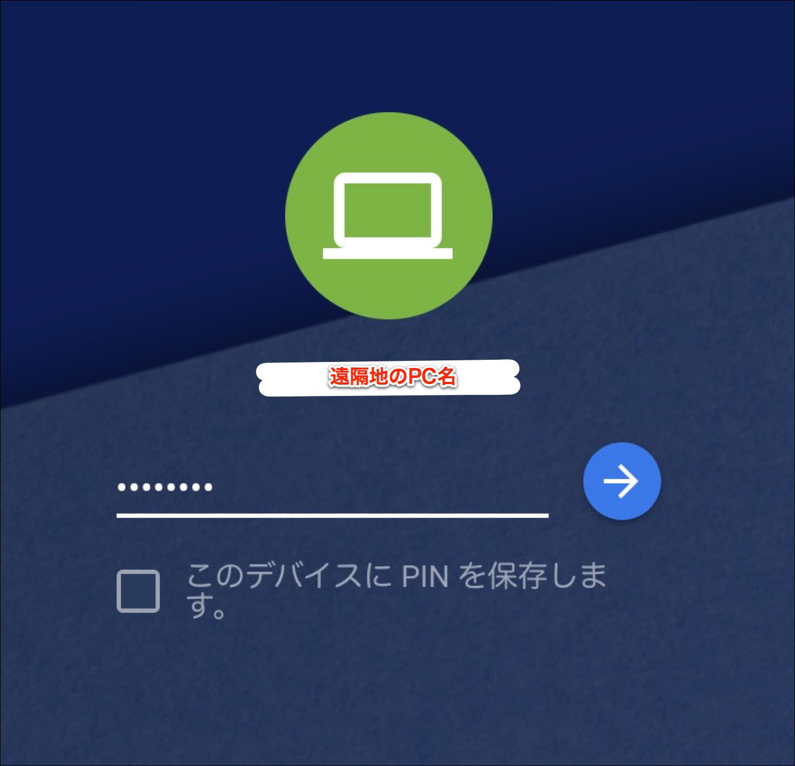
最初に設定したPINコードを入力します。

#### リモートアクセス画面
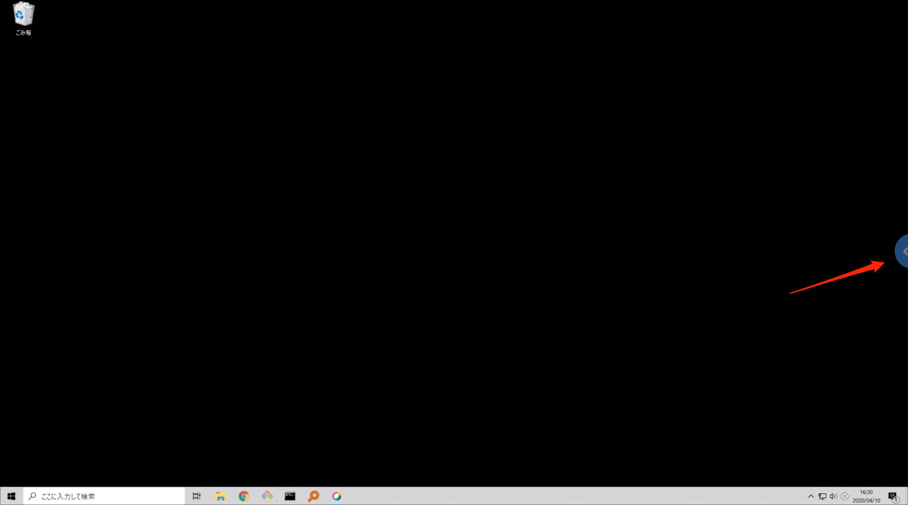
遠隔地にあるPCにログインができました。画面右にあるトグルボタンをクリックすると操作メニューを呼び出すことができます。

#### セッションのオプション設定
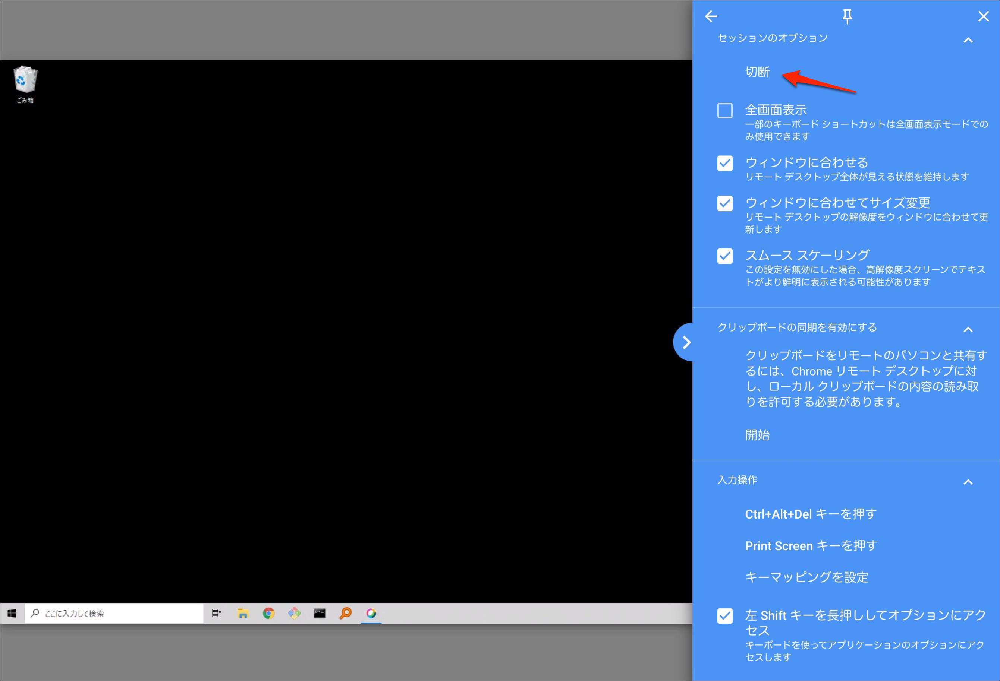
ここの[切断]をクリックすると遠隔地PCとの接続を終了します。(ウィンドウを閉じても切断されます)

## 終わりに
リモートデスクトップ機能を使うと、非常に便利ですのでぜひ活用してみてください。最初のセットアップだけ設定しておけば、遠隔地からのサポートも楽々です。

ここでご紹介したChromeリモートデスクトップ以外にもいくつも種類がありますので、比較してみるのも面白いと思います。