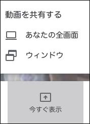
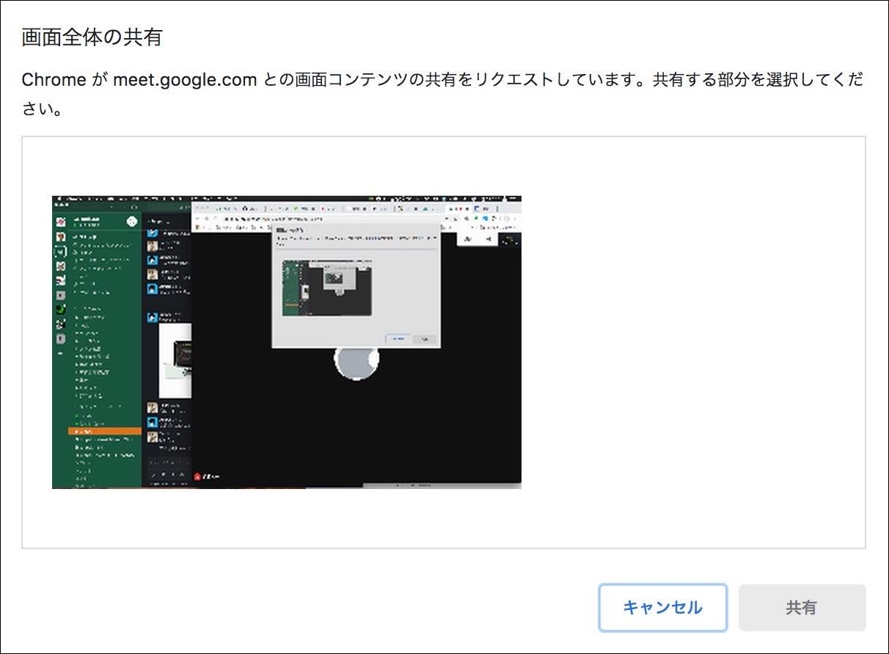
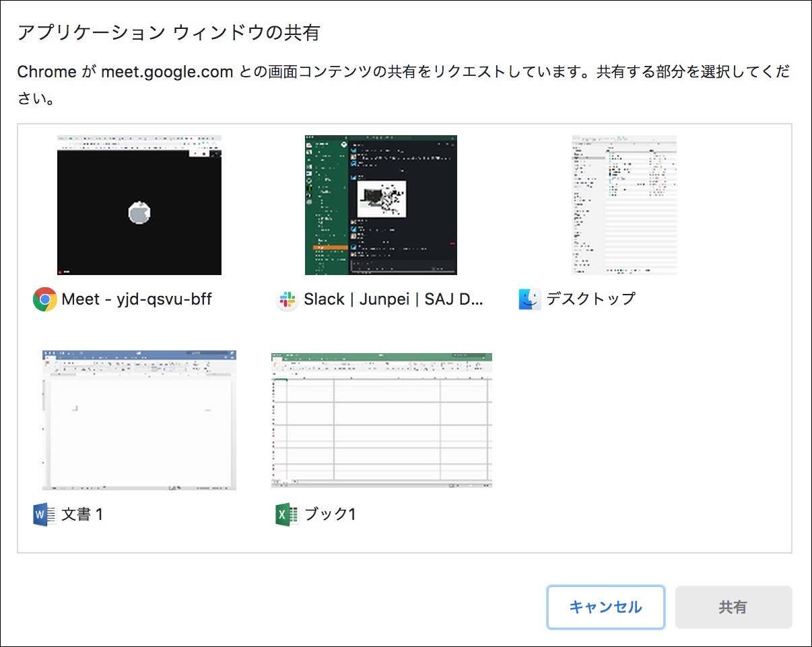
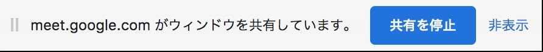
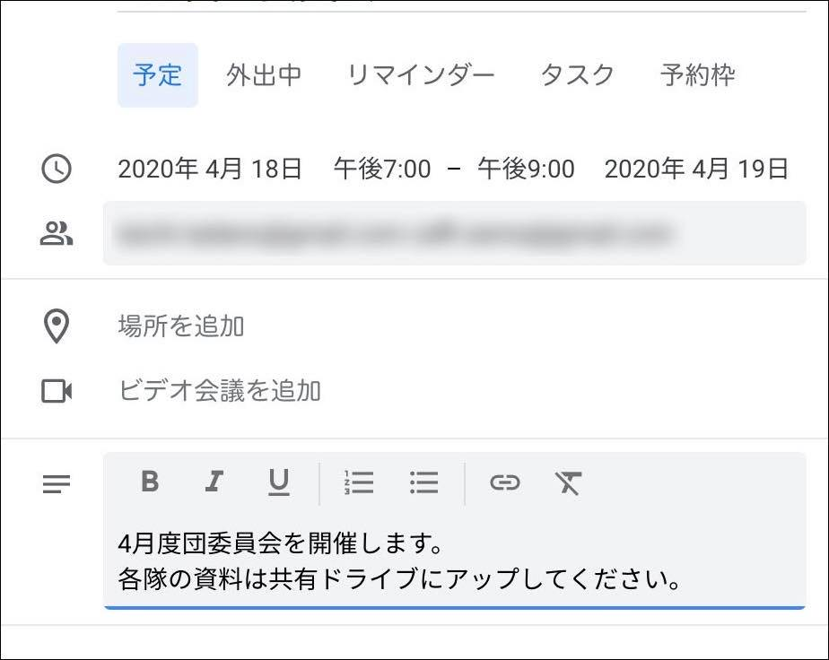

[Google Meet](https://apps.google.com/meet/){:target="_blank" :rel="noreferrer"}での高度な使い方をご紹介します。

## 画面共有

オンラインミーティングでは画面共有機能を使うと全員に資料を見せながら話をできるので便利です。

共有の仕方は2通りあります。

- あなたの全画面 : パソコンで表示している全画面を共有します
- ウィンドウ : 例えば「wordだけ、excelだけ、pdfだけ」などウィンドウ単位での表示機能です

### 画面共有 - 「あなたの全画面」
画面共有機能で「あなたの全画面」を選択すると、このような確認画面が出てきます。

共有する画面を選択して共有をクリックすると会議の参加者全員と画面を共有できます。(外部モニターを繋いでいる場合などはどちらの画面を共有するか選択してください)

あなたが操作、表示した画面そのものが参加者にも共有されます。

### 画面共有 - 「ウィンドウ」

画面共有機能で「ウィンドウ」を選択すると、このような確認画面が出てきます。

共有するウィンドウ(アプリケーション)を選択して共有をクリックすると会議の参加者全員と画面を共有できます。

「画面全体を共有はしたくないけど、PDFだけ共有したい」など状況に合わせて使ってみてください。

### 画面共有 - 共有の停止

画面の共有を停止したいときは、ウィンドウの下部に表示されている 共有を停止 をクリックします。

## カレンダーからオンラインミーティングを開催してみよう

Googleカレンダーからオンラインミーティングの開催予定を作ることができます。

参加者に招待状も送ることができ、出欠管理もできるので活用してみてください。

詳しくは[カレンダーからオンラインミーティングを開催](GoogleMeet-calendar.md)をご覧下さい。

## ミーティングを録画しよう
Meetの録画機能は2022年1月9日で終了しました。 
別の方法で画面録画をする方法は[Google Meet 会議の録画ガイド](GoogleMeet-recording.md)を参照して下さい。

## 共同主催者を設定する

Meetで共同主催者が設定できます。 
詳しくは[Meetで共同主催者を設定する](GoogleMeet-co-hosts.md)を参照して下さい。