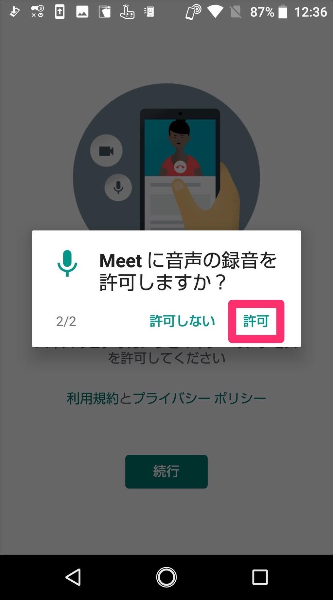
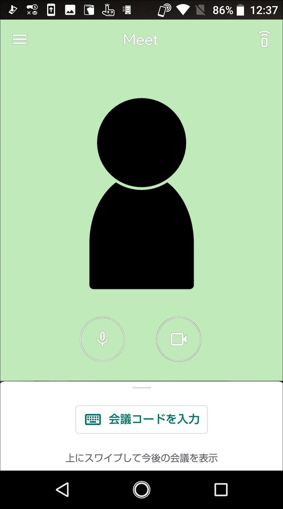
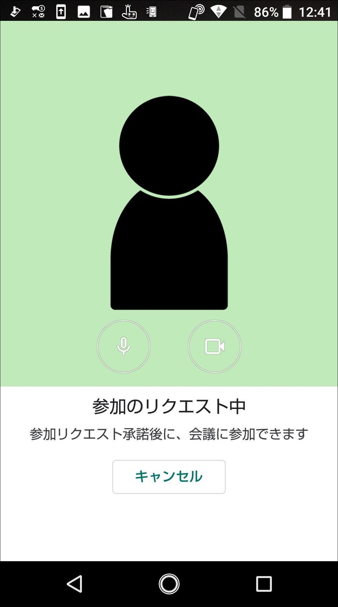

[Google Meet使い方ガイド](GoogleMeet.md) > [スマートフォン & タブレットでの利用について](GoogleMeet-smartphone.md) > Android

## android端末にMeetのアプリをインストールする方法


Playストア を起動します。

このページをandroid端末(スマートフォンもしくはタブレット)で見ている場合は[こちら](https://play.google.com/store/apps/details?id=com.google.android.apps.meetings)から直接開くことができます。

※androidのスマートフォンとタブレットのインストール手順は同じですので適宜読み替えてください。


検索ボックスをタップします


検索ボックスに meet と入力して、検索候補の "Google Meet"をタップします


インストール をタップします


インストールが完了したら [開く] をタップしま


Meetのアプリが起動しました。

[続行] をタップします。


Meetアプリでカメラを使えるように [OK] をタップします。

※会議の参加時にカメラをオフにすることもできます。



同様にMeetアプリでマイクを使えるように [OK] をタップします。

※会議の参加時にマイクをオフにすることもできます。


[OK] をタップします。

Google Playのアカウントでログインしている状態となりますので、別のアカウントでMeetを使いたい場合は画面下部の [切り替え] をタップして使用するアカウントへログインしてください。



ここまででMeetを使う準備が完了しました。

会議が始まる前までにここまで完了させておきましょう。

一端アプリは終了させてOKです。

会議に参加するには主催者から届く招待状にあるリンクをタップするか、会議コード(10桁のアルファベット)をこの画面で直接入力して参加することになります。

実際の参加手順は下記をご覧下さい。

## 会議に参加するには


会議の主催者から届いた招待状(メールやチャットなど)をスマートフォンかタブレットで開きます。

(例)

```
ビデオ通話に参加するには次のリンクをクリックしてください。https://meet.google.com/abc-defg-hij

スマートフォンで参加する場合は、+1 000-000-000 とダイヤルし、PIN（000 000 000#）を入力してください
```

↑の文中にあるリンクをタップすると自動的にMeetアプリが起動して、左の画面になります。

続けて [参加をリクエスト] をタップします。



[参加をリクエスト] すると主催者に通知が送られます。

主催者から承認されるまで、この画面のまま待って下さい。


主催者から承認されるとこの様な画面に切り替わります。

これで会議へ参加することができました。

実際に音声や動画に問題がないか、呼びかけてテストをしてみてください。


## 会議から退出する方法


会議から退出するには画面の上部エリアをタップします。

アイコンが出現するので、中央の赤い受話器マークをタップします。

これで会議から退出ができます。