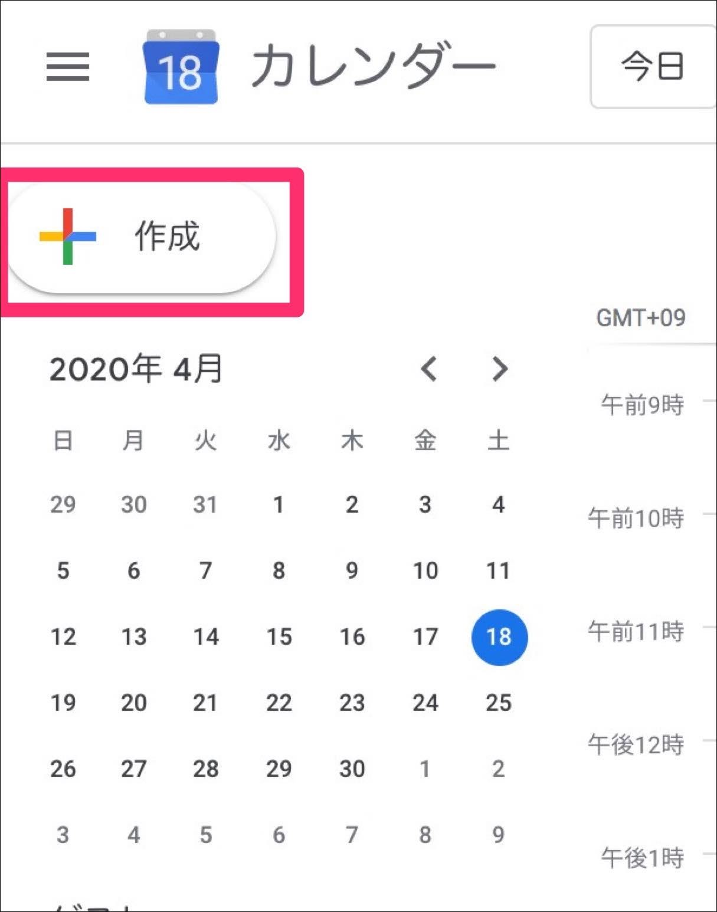
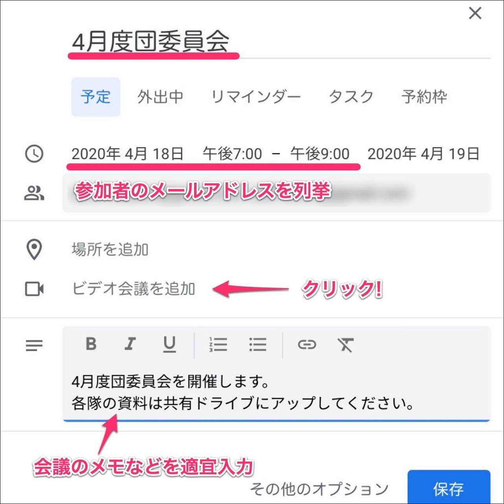
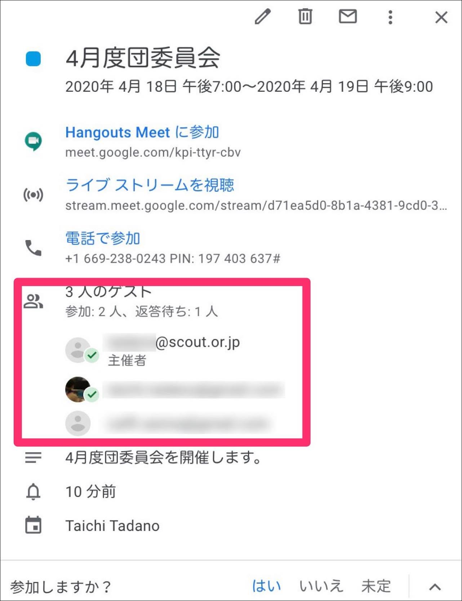
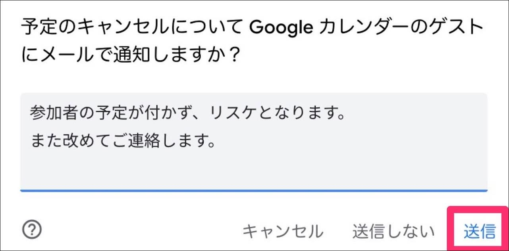

# Google Meet カレンダーからオンラインミーティングを開催してみよう

団委員会やリーダー会議、オンライン集会などは予め計画されていることがほとんどです。

カレンダーと連携させて、Meetでのミーティング開催予約をしてみましょう。

以下の例は団委員会の開催予約をカレンダーから行い、参加メンバーに通知するデモとなります。ぜひ参考にしてみてください。

## GoogleカレンダーでMeetの開催予定を作る

Google Workspaceのアカウントでログインしたら、画面右上のアイコンをクリックして [カレンダー] を起動します。

カレンダーを起動したら、画面左上の [+ 作成] をクリックします。

会議の名称、時間帯(開始時刻&終了時刻)、会議のメモなどを入力します。

#### 【ゲストを追加】

会議参加者のメールアドレスを列挙します。

leader1@hoge.com leader2@fuga.com

のようにメールアドレスの間は半角スペースを入れてください。(ここでメールアドレスを追加しなくても、後から参加者へ通知する方法があるので省略可能です。後述の"会議への参加URLを知る方法"を参照して下さい。)

ここまでできたら [ビデオ会議を追加] をクリックします。

これでMeetの開催予約ができました。

入力内容を確認して、問題が無ければ [保存]  をクリックしてください。

#### 【ライブストリーム】

通常の使用においては設定の必要はありません。(詳しくは[ビデオ会議のライブ ストリーミング](https://support.google.com/meet/answer/9308630?co=GENIE.Platform%3DDesktop&hl=ja){:target="_blank" :rel="noreferrer"}を参照してください)

保存ボタンをクリックすると、参加者に招待メールを送信するか確認のダイアログが出ます。

直接ここから送信する場合は [送信] をしてください。

メールではなく、別の連絡手段で通知をする場合は [送信しない] でOKです。

このような確認画面が出ますが、送信先を確認の上問題が無ければ [外部のゲストを招待] をクリックしてください。

※ 外部のゲストとは。

日本連盟から発行したGoogle Workspaceに属していないメールアドレスが含まれる場合、このような確認画面となります。

参加者へ届いたメールのサンプルです。(iPhoneでの表示です)

会議内容とMeetの参加URLが記載されています。

メール末尾をタップして主催者へ出欠を返信できます。

参加者から出欠が入力されると、画面上で確認できます。

☑️の付いたユーザーが参加予定。

### 会議への参加URLを知る方法

参加者へ再度通知する場合や参加者が増えて新規にお知らせする場合など、参加URLを伝える必要があります。

Googleカレンダーを開き、設定した会議予定を開きます。

左図の画面のようになるので `Hangouts Meetに参加` の付近へマウスカーソルを合わせます。右側にアイコンが浮き上がります。このアイコンをクリックすると会議の参加URLがクリップボードにコピーされます。(https://meets.google.com/xxx-xxxx-xxx の形式)

この参加URLをメールやチャットで参加者へ伝えて下さい。

### 会議を削除する場合

会議の都合が悪くなった場合はカレンダー上から会議予定を削除します。

ゲスト参加者が入力されている場合はこのような確認メッセージが表示されますので、[送信] をクリックします。

するとゲスト参加者へメールが送信され、通知されます。