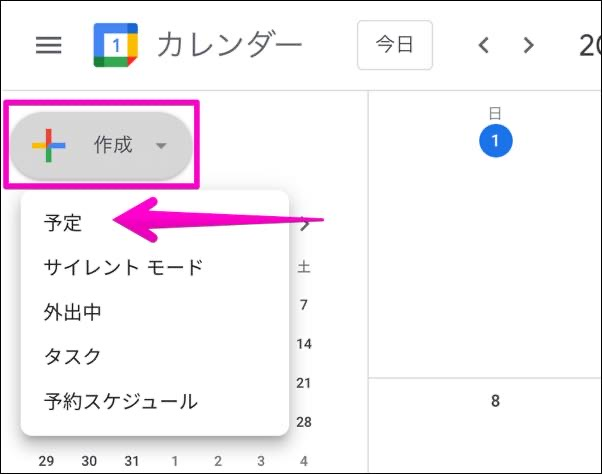
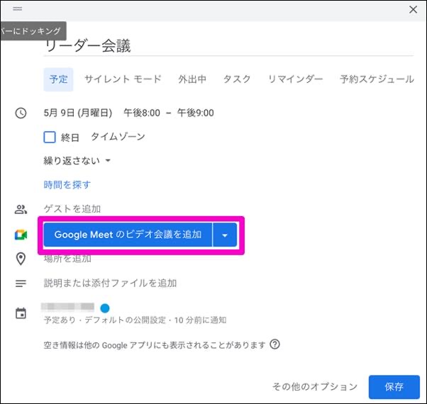
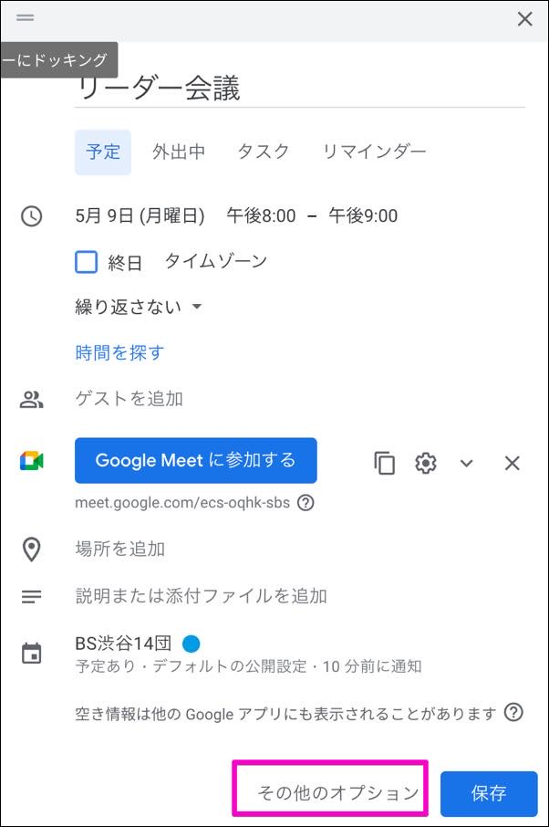
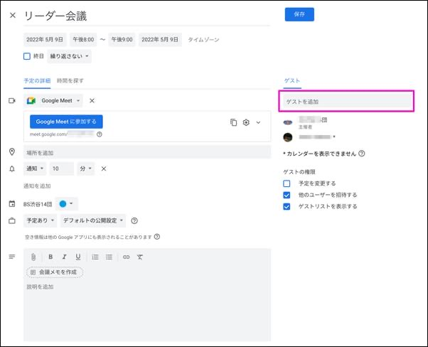
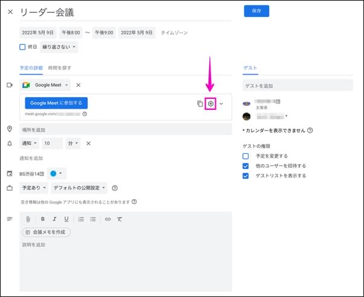
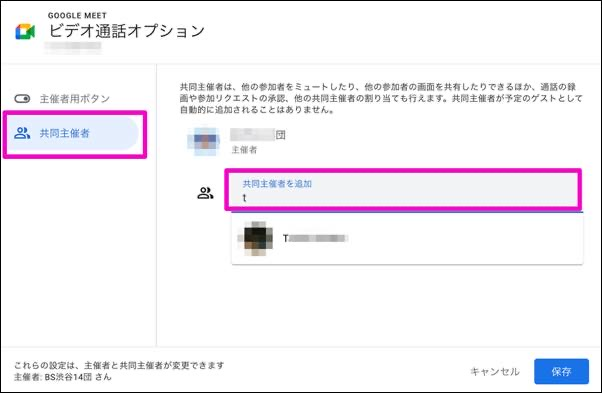
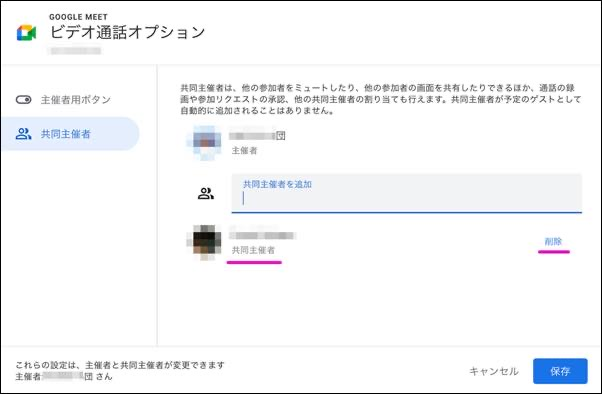
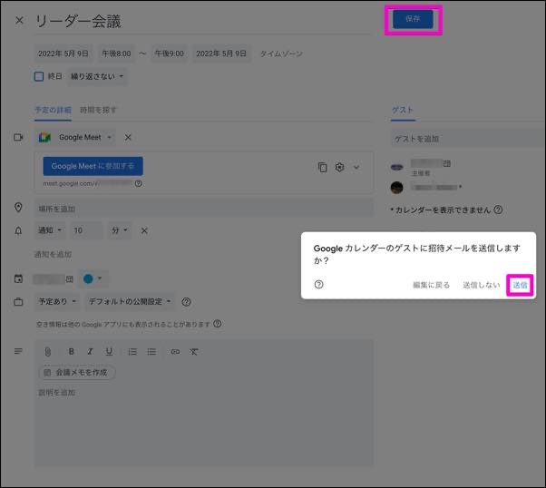

# Meetで共同主催者を設定する

## 共同主催者のできること

共同主催者を設定するとミーティングの主催者が欠席したり、遅刻する場合でもミーティングをスムーズに運営することができるようになります。
具体的には共同主催者は以下の操作ができます。

- 他の参加者をミュートにする
- 他の参加者の画面を共有する
- 参加リクエストの承認
- 他の参加者へ共同主催者の割り当て

共同主催者の設定方法は以下の通りです。

## 1. カレンダーから予定を作成する

[Googleカレンダー]((https://calendar.google.com/))へアクセスし、`作成` > `予定` の順にクリックします。

## 2. ビデオ会議を追加する

ミーティングの名称や日時を入力し、 **Google Meetのビデオ会議を追加** をクリックします。

## 3. その他のオプション

続けて **その他のオプション**をクリックします。

## 4. ゲストを追加する

会議のオプション設定画面に切り替わります。画面右にある **ゲストを追加** 欄に共同主催者として割り当てる方のメールアドレスを入力します。 
この時に共同主催者**以外**の方を一緒に入力しても影響はありません。

## 5. ビデオ通話のオプション

共同主催者のゲスト登録ができたらビデオ通話のオプション設定をします。**歯車アイコン**をクリックします。

## 6. 共同主催者を追加

ビデオ通話オプションの画面に切り替わります。左メニューから **共同主催者** をクリックします。 
画面右の **共同主催者を追加** ボックスに 上の4で追加した共同主催者(ゲスト)の氏名を入力します。(数文字入力するとその候補が下部に表示されるのでマウスで選択します) 
共同主催者の登録が完了したら画面右下の **保存** をクリックします。(元の画面に戻ります)

## 7. 共同主催者の削除

共同主催者を削除する場合はこの画面で **削除** をクリックします。

## 8. 招待メールの送信

ミーティングの設定画面に戻るので画面上部にある**保存**をクリックします。 
**Googleカレンダーのゲストに招待メールを送信しますか?**という確認メッセージが出てきますが、共同主催者にその旨を伝えるために送信することをお勧めします。 
※招待メールは共同主催者だけでなく、その他のゲストにも一斉に送信されます。

以上で共同主催者を設定することができます。ご活用下さい。