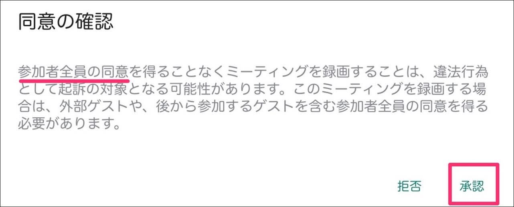
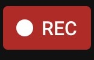
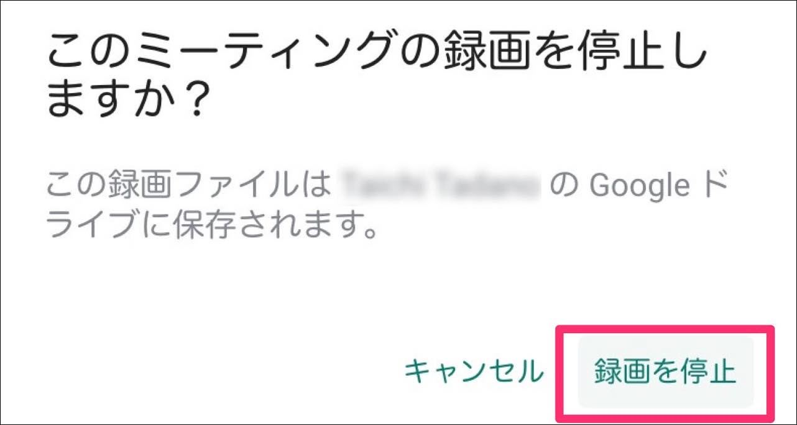
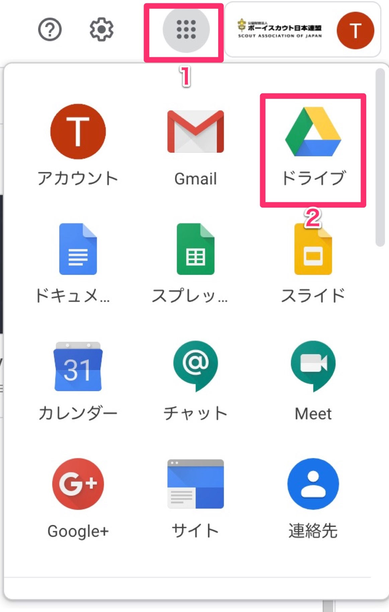
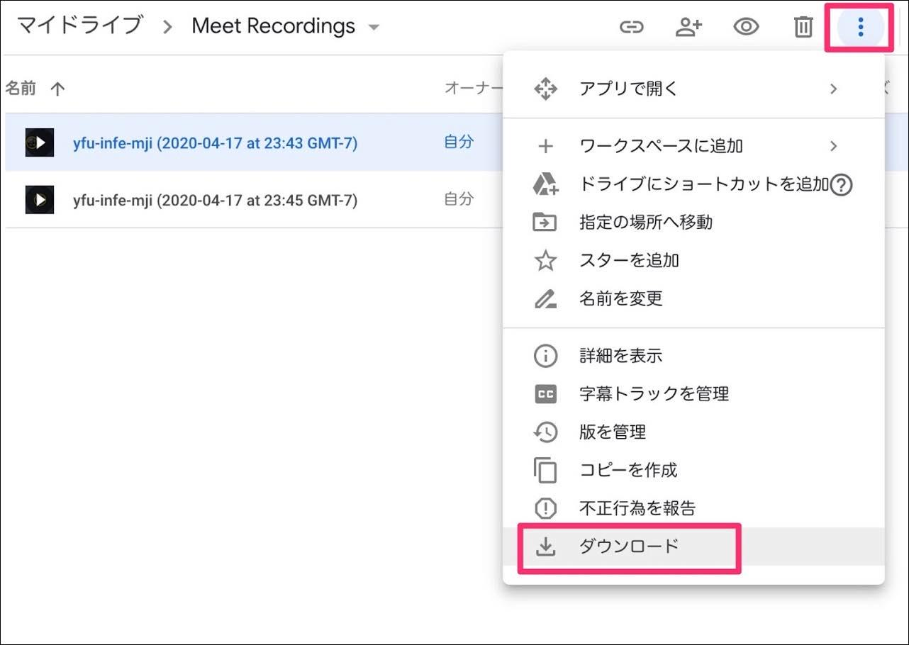
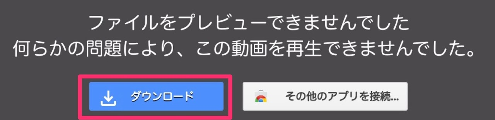

# Google Meet 会議の録画ガイド
[Google Meet](https://apps.google.com/meet/)で会議を録画する方法です。

## 録画の開始

Meetで会議を開始したら右下のアイコンをクリックし、メニューから [ミーティングを録画] をクリックします。

ミーティングの録画を開始する前に、参加者全員から録画する事への同意があるか確認してください。

全員からの承諾があれば [承認] をクリックします。

会議の録画中は画面左上に [○ REC] と全員に表示されます。

主催者の方は録画開始時に全員に再度告知するといいでしょう。

## 録画の停止

録画を停止するには、画面右下のアイコンをクリックし、メニューから [録画を停止] をクリックします。

確認メッセージが出るので、[録画を停止] をクリックします。

## 録画ファイルの保存場所

録画したファイルはGoogleドライブにアップされます。

図のようにアイコンをクリックして[Googleドライブ](https://drive.google.com/)にアクセスします。

Googleドライブにアクセスすると、`Meet Recordings` というフォルダが自動的に作成されています。

このMeet Recordingsを開くと録画したミーティングの動画ファイルがアップされています。

見たい動画を選択し、メニューから [ダウンロード] をクリックするとパソコンにダウンロードすることができます。

※ 録画時間などによりファイルの生成に時間がかかる場合があります。ファイルの用意が完了するとメールで案内が届きますので参考にしてください。

録画ファイルをダブルクリックしても再生することができません。

上図の手順でパソコンにダウンロードしてご覧下さい。