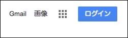
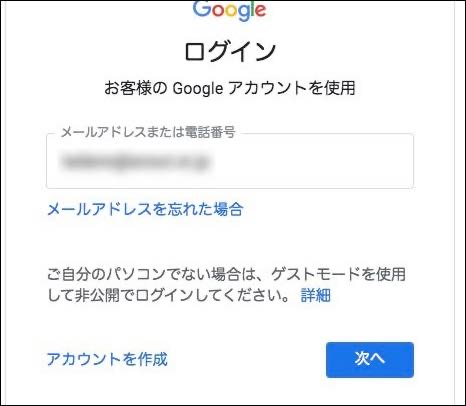
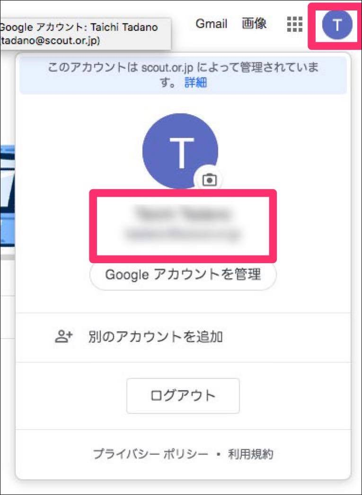
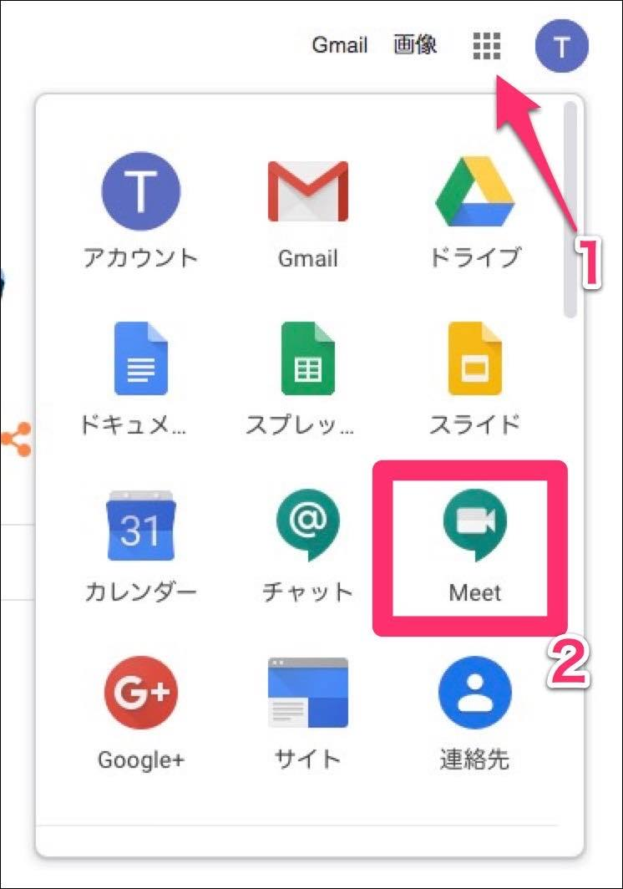
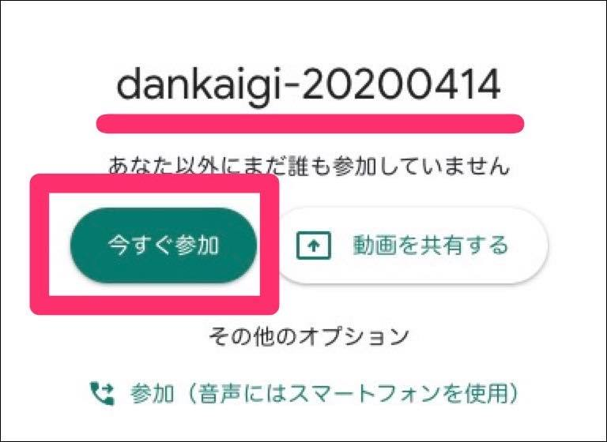
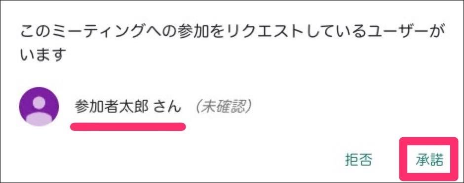

# Google Meet使い方ガイド

[Google Meet](https://apps.google.com/meet/)を使ってオンラインミーティングを開催してみましょう。

ステップに従って操作を進めれば、簡単にミーティングを開催できます。

## オンライン会議の環境を整えよう
### 全員が共通で用意するもの
- インターネットに接続されていること
- パソコン(webカメラ、マイク、スピーカーが付いているもの)、もしくはタブレットなど
- 会議の開催日時を事前に調整しておくこと(○月×日 XX時XX分〜)

## 会議の主催者が用意するもの
- 日本連盟から発行されたGoogle Workspaceのアカウント


# 会議のセットアップ(主催者がやること)
Google Workspaceのアカウントにログインする。(日本連盟から発行されたアカウントが必要です)

もし他のGoogleアカウントにログインしている場合はアカウントを切り替えてから使用してください。

### Googleアカウントへのログイン方法


ブラウザからに[googleにアクセス](https://google.com)して画面右上の ログイン をクリックします。



日本連盟から発行されたアカウント(メールアドレス)を入力します


日本連盟から発行されたアカウント(パスワード)を入力します



メールアドレスとパスワードでログインができたら確認をしてみましょう。

右上のアイコンをクリックすると、現在ログインしている情報を確認できます。(左図ではTと表示されていますが、別のアルファベットの場合があります)

日本連盟から発行されたメールアドレスが表示されているか確認してください。


### [参考] Googleアカウントを追加する方法
アカウントを追加する場合は左図のTアイコン(環境によって異なります)をクリックするとサブメニューが表れます。

"別のアカウントを追加"をクリックし、日本連盟から発行されたアカウントでログインをしてください。



### Meetを起動する
[1]のアイコンをクリック

[2]のMeetをクリックします。これでMeetが起動します。

もしMeetのアイコンが見つからない場合は、日本連盟から発行されたアカウントでログインをしているか確認してください。

## ミーティングを開始する


Meetを起動するとこのような画面になります。

"ミーティングに参加または開始"をクリックします。

### ミーティングの名前を付ける


ミーティングの名称を入力します。

名称は他の人とかぶらないような名前を付けてください。空白もしくは簡単な名称でかぶった場合、開始タイミングによっては同じ会議室が開かれてしまう可能性があります！名称に時間、地区名、団名などを入れるとかぶりにくいです。

名称の準備ができたら"続行"をクリックします。

### ミーティングを開始する


"続行"をクリックすると画面が切り替わります。

設定したミーティング名を確認して、"今すぐ参加"をクリックします。

### 招待状を送る


この時点では主催者のみの状態です。

参加者へミーティングへの招待状を送ります。

"参加に必要な情報をコピー"をクリックすると、クリップボードに必要な情報がコピーされます。

この情報をメールやチャットなどでミーティングの参加者へ案内を送ってください。(Meetから直接招待状を送る方法は次の項目を参照)

```
(招待状の例)

ビデオ通話に参加するには次のリンクをクリックしてください。https://meet.google.com/xxx-xxxx-xxx

スマートフォンで参加する場合は、+1 000-000-0000 とダイヤルし、PIN（000 000 000#）を入力してください

これ以外の電話番号を表示するには、次のリンクをクリックしてください。https://tel.meet/xxx-xxxx-xxx?hs=5
```


【Meetから直接招待状を送る方法(1)】

上図の"ユーザーを追加"をクリックするとこのような画面に切り替わります。

"名前またはメールアドレスを入力"と書いてある入力欄に招待者のメールアドレスを貼り付けてください(複数の送信先が可能です)。

※Googleの連絡先に登録されている場合は氏名入力でメールアドレス候補を呼び出すことができますが、候補に出てこない場合は普段お使いのメールソフトなどからコピーして貼り付ける必要があります。


【Meetから直接招待状を送る方法(2)】

会議開始後、招待状を送る方法です。

画面左上のアイコンをクリックし、次に現れる画面で [ユーザーを追加] をクリックします。

次の画面で招待したいユーザーのメールアドレスを入力して招待状を発信します。

## ミーティングへ参加する(参加者がやること)


メールやチャットで招待状を受け取った参加者は案内にあるリンクにアクセスします。

すると会議の参加画面になりますので、氏名を入力して"参加をリクエスト"をクリックします。氏名は主催者や他の参加者にわかりやすいように入力してください。


主催者へミーティング参加のリクエストが送られました。参加が承認されるまでしばらく待ちます。

## ミーティングへの参加承認(主催者がやること)



参加者からリクエストが届きました。

氏名を確認して、"承諾"をクリックします。

参加者からリクエストが来る度に確認と承諾を行ってください。

## 操作方法


### 画面下部のアイコン
各機能はこのようになっています。


設定オプションではこのような設定が可能になっています。

マイクやカメラの調子がおかしい時は、ここから設定を確認が可能です。


#### 参加者一覧の確認
画面右上の人型アイコンをクリックすると、参加者一覧が確認できます。

また「チャット」では参加者に対してテキストでメッセージを発信することができます。

「会話を中断させたくないけどお知らせしたい」時などに使うと便利です。


# ミーティングを終了する
画面下部の「ミーティングから退出する」をクリックすると参加者は通話から退出できます。

主催者は次のメニューから選択できます：  
- 終了せずに自分だけを退出  
自分は会議から退出します。他の参加者は会議を続けることが出来ます。

- 通話を終了  
自分と参加者全員を退出させ、会議を終了します。主催者が再度入室しない限り、他の参加者は同じURL（会議コード）で**再度会議に参加することは出来ません**。  
同じ会議URLを使い回す**入退出自由の会議においては選択しないよう**ご注意ください。


## オンラインミーティング開催のヒント

!!! hint "オンラインミーティング開催のヒント"
    - いきなり本番をやらずにテストをしましょう<br>「音声が聞こえない(大きい、小さい)」「映像が映らない」などのトラブルはつきものです。本番前にテストをして解決しておきましょう

    - どんどんトライを!<br>
    ミーティングを壊してしまうような設定はありません。色々と試してみましょう!

    - 会議の進行をスマートに<br>
    画面共有や共有フォルダなどを上手く活用してスマートな会議運営を!


## 高度な使い方
Meetを更に便利に使うため、[高度な使い方ガイド](GoogleMeet-adv.md)をご用意しています。<br>
是非活用してみて下さい。

- [カレンダーからミーティングを予約する](GoogleMeet-calendar.md)
- [ミーティングを録画する](GoogleMeet-recording.md)

# [スマートフォン & タブレット](GoogleMeet-smartphone.md)での利用
- [android端末にインストール&使い方](GoogleMeet-android.md) 
- [iOS端末にインストール&使い方](GoogleMeet-ios.md) 
