# Zoom使い方ガイド Android版

[Zoom](https://zoom.us/)の無料プランを使ってオンラインミーティングを開催してみましょう。

※無料プランはグループミーティングが40分に制限されています。

このページではAndroidアプリで解説しています。

* パソコンの方は[こちら](ZoomMeeting.md)
* iOSの方は[こちら](ios.md)

を参照してください。

## 条件
* インターネットに接続されていること
* Androidバージョン5以降のデバイス
* 本体付属のカメラとマイク (イヤホン端子またはブルートゥース接続のイヤホン・マイクなど)

## Zoomのアプリをインストールする
Zoomのアプリをインストールしておくと便利なので、まずはお使いのデバイスにアプリをインストールしましょう。

* [Playストアからインストールはこちら](https://play.google.com/store/apps/details?id=us.zoom.videomeetings)

[ここ](https://play.google.com/store/apps/details?id=us.zoom.videomeetings)を開くとPlayストアが開くので、アプリ名を確認して`インストール`をタップします。

インストールが完了したら`開く`をタップします。

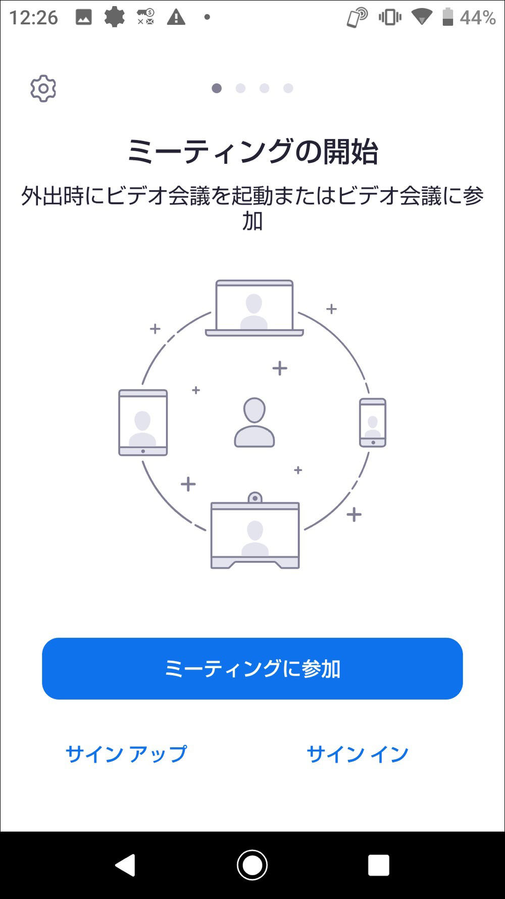
Zoomのアプリが起動しました。ここまで確認できたらアプリは一端終了してください。

## ミーティングに参加する
### 招待リンクからミーティングに参加

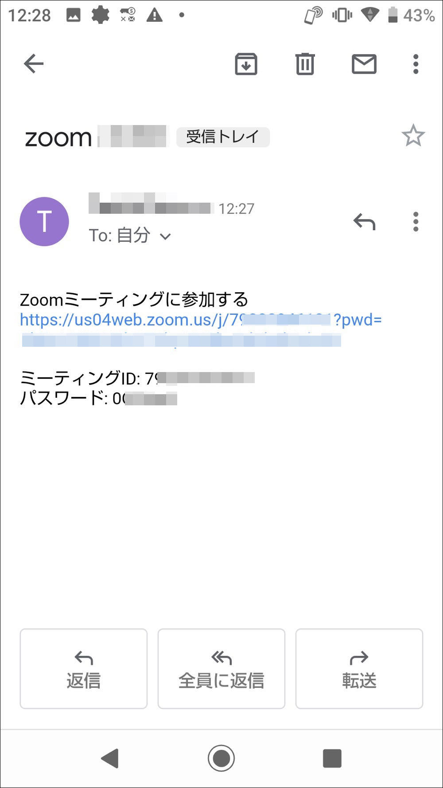

主催者から届いた招待メール(または各種チャットアプリ)を開き、`Zoomミーティングに参加する`と書かれたリンクをクリックします。

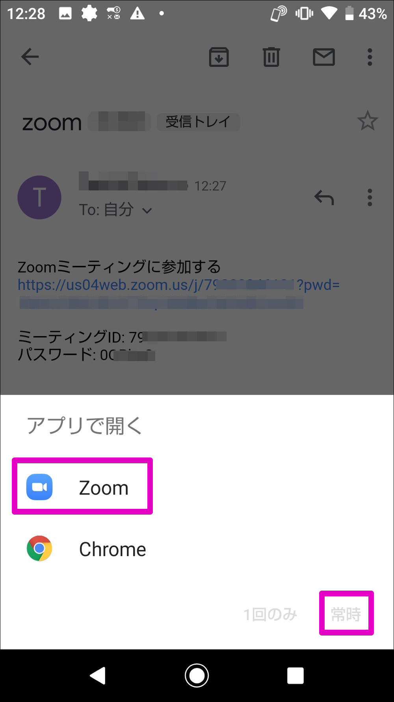

Zoomアプリを開く確認画面が現れますので`zoom`をタップして、更に`常時`をタップします。

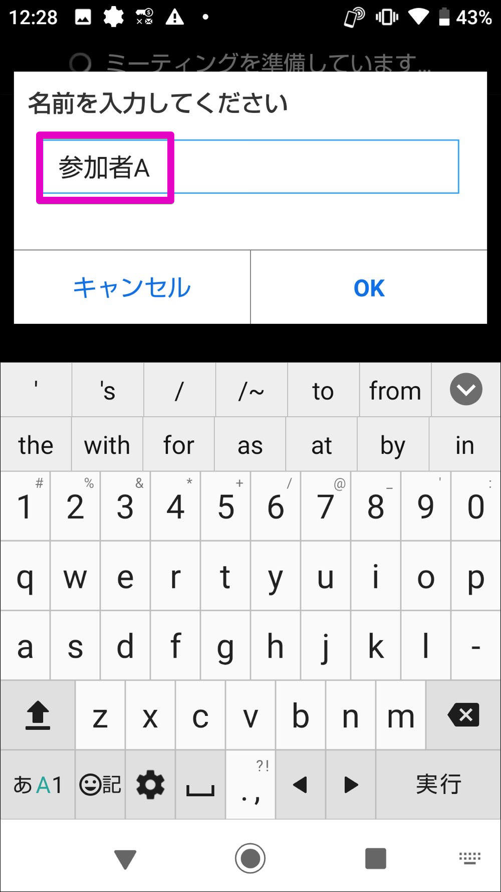

ここで参加者名を入力します。主催者や他の参加者かにわかりやすい名前を入力するといいと思います。

主催者から参加が承認されて、ミーティングに参加することができました。

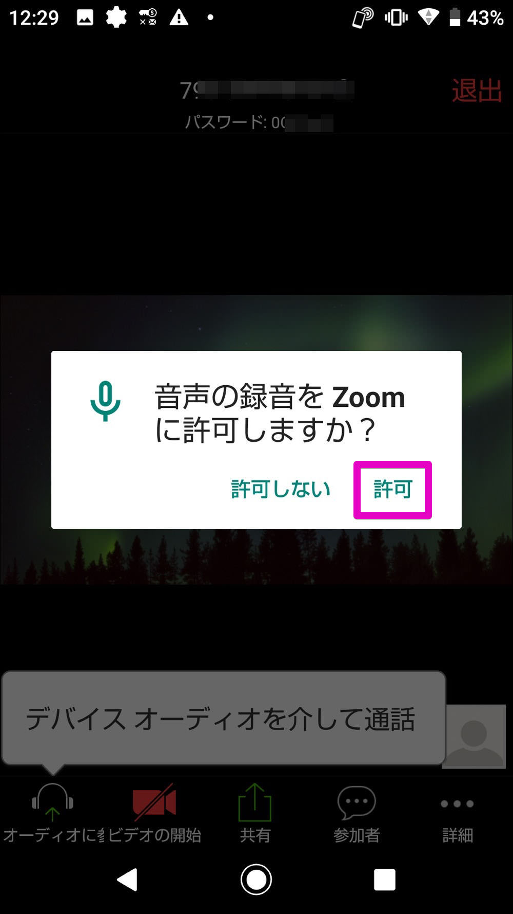
マイクの使用確認が出たら`許可`をタップします。

カメラの使用確認が出たら`許可`をタップします。

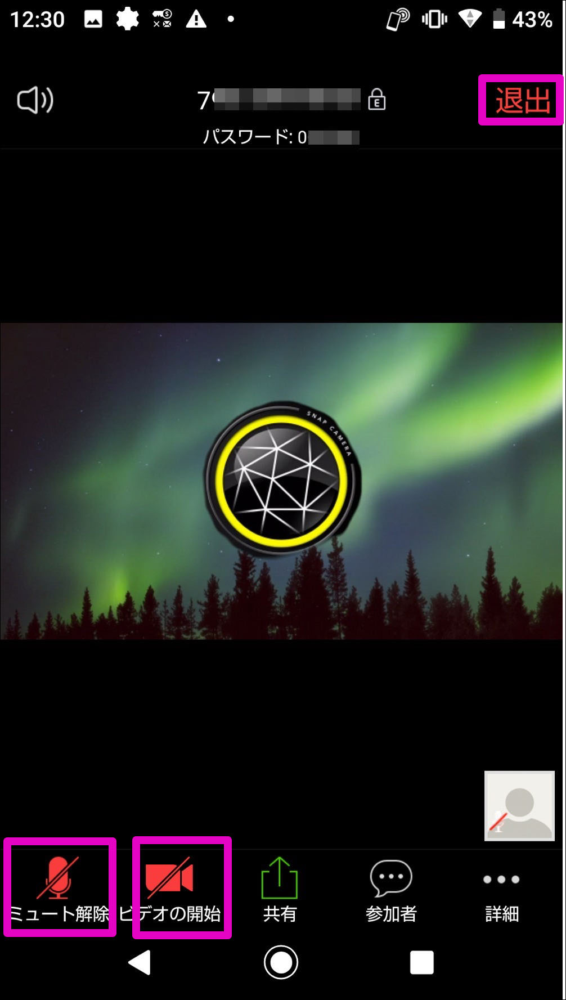
画面のどこかをタップすると、各種のボタンを表示出来ます。左下の`ミュート`、`ビデオ`で音声やカメラを一時的に解除、再接続をすることができます。

### 退出する方法
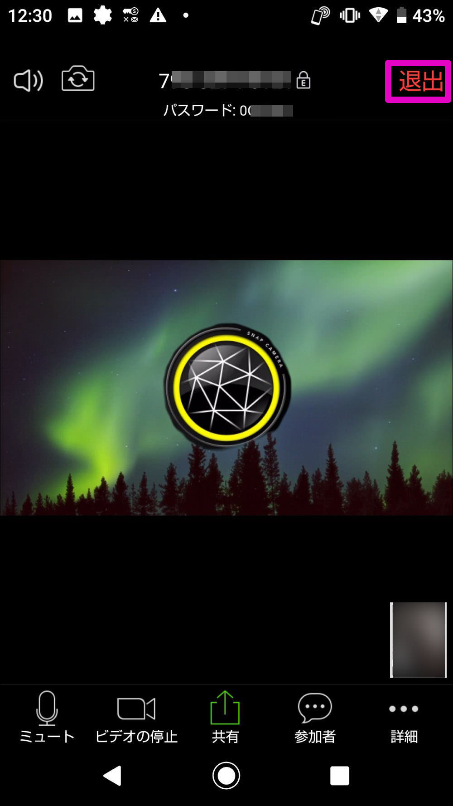
画面のどこかをタップし、右上の`退出`をタップします。

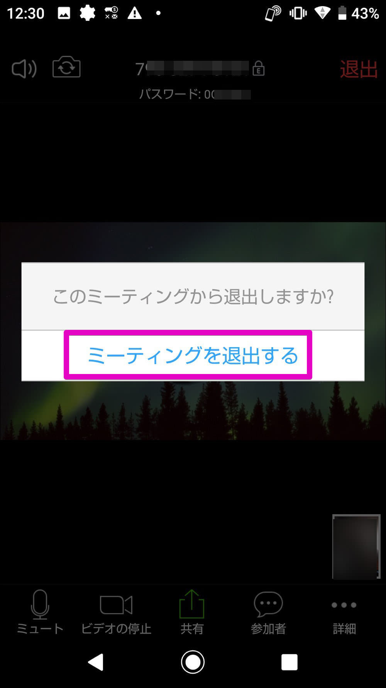
確認画面の`ミーティングを退出`をタップすると退出することができます。アプリを終了させてください。

## スマホアプリから会議を予約する
団委員会などは開催日が決まっている場合が多いと思います。そんなときはスマホアプリから会議予約をしておきましょう。予約をしておけば予め参加者に通知を送ることができ、スムーズにミーティングに誘導することができます。

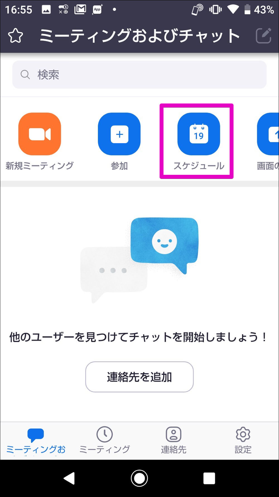

スマホアプリを起動して、`スケジュール`をタップします。

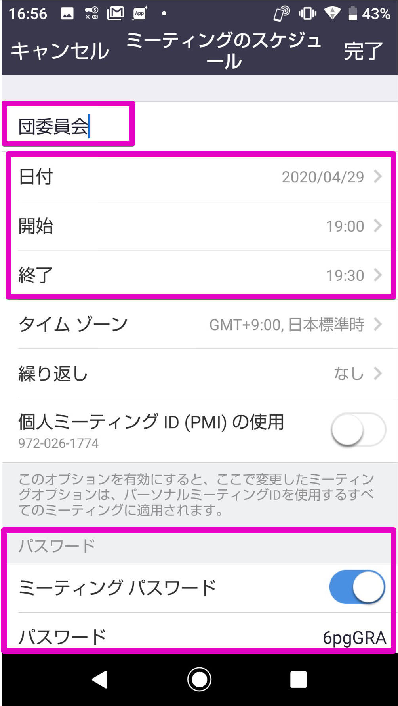

設定画面が開きます。会議の名称や日時などを入力します。Zoomの無償版は3名以上の会議は40分となっていますのでご注意ください。**パスワードは必ず設定**するようにしましょう。(任意のものに変更が可能です)

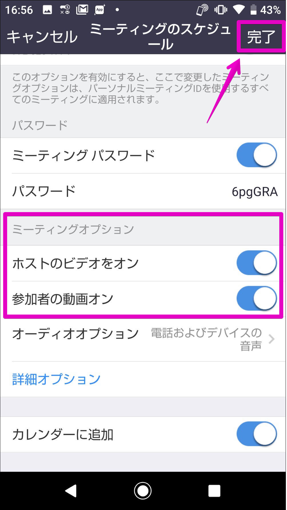

続けてミーティングオプションを設定します。ここではホスト(会議の主催者)と参加者のビデオ映像を設定します。通常の使用であれば`オン`で問題ありません。ここがオンの場合、参加者自身がオンとオフを切り替えることができます。

ここまで入力できたら右上の`完了`をタップします。

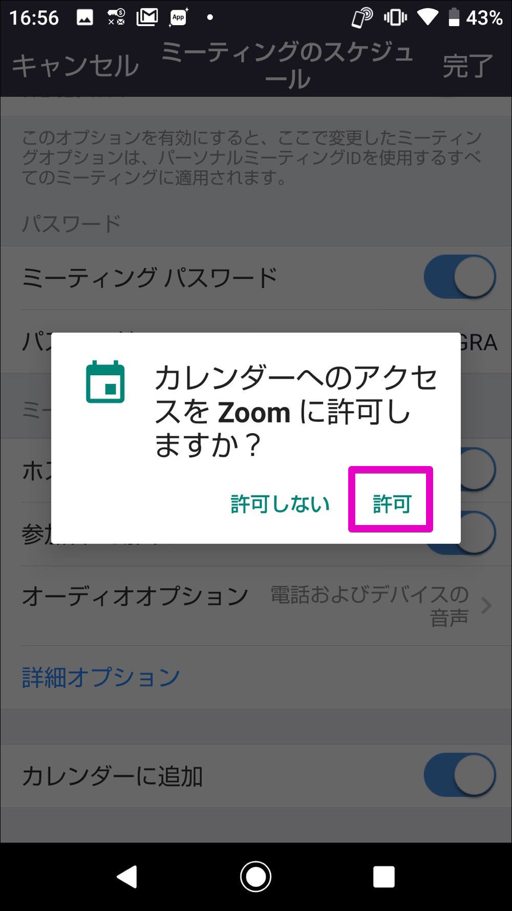

カレンダーと連動させる場合はこの様な確認画面で`許可`をタップします。

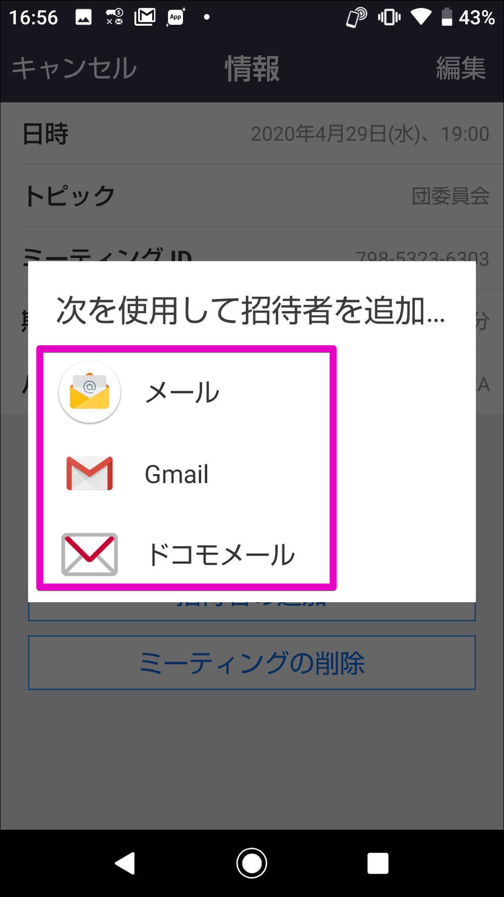
続けてミーティングへの招待画面に切り替わりますがここでは一端欄外をタップして元の画面に戻ります。(慣れてきたらここから直接招待状を送っても構いません)

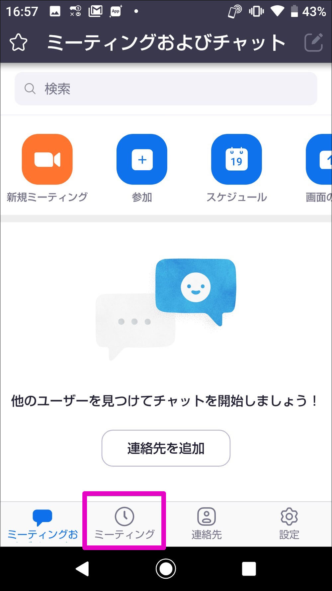

Zoomアプリの元の画面に戻りました。画面下の`ミーティング`をタップします。

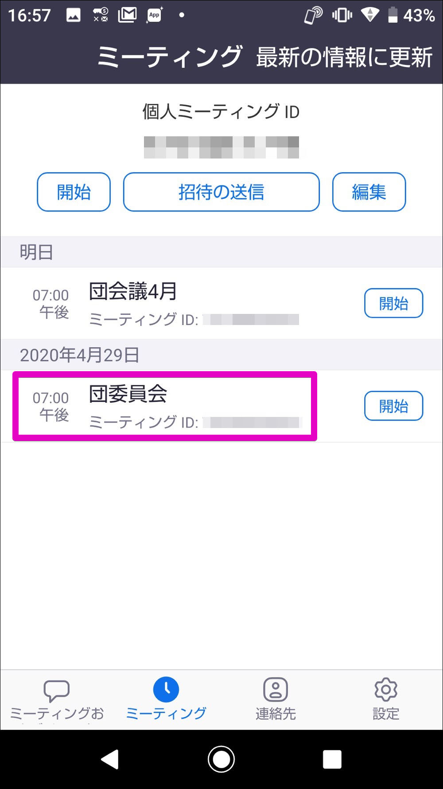

ここでは予約設定済みの会議が一覧で表示出来ます。先程予約した団委員会をタップしてみましょう。

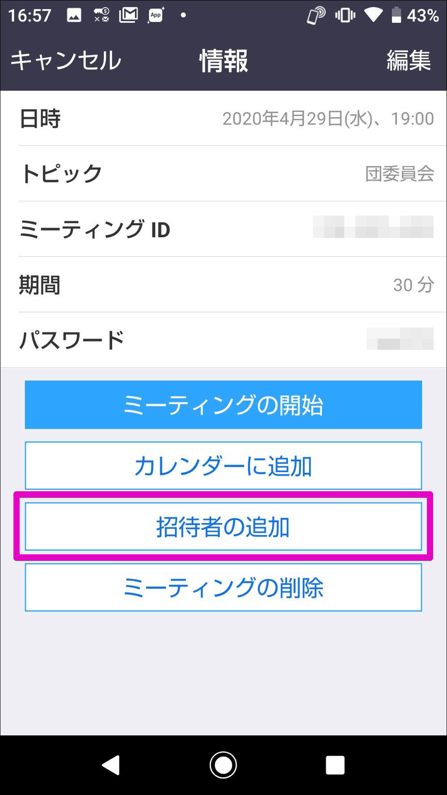

設定した団委員会のミーティング詳細が表示されました。設定内容を確認、修正が可能です。

`招待者の追加`をタップして招待状を送りましょう。

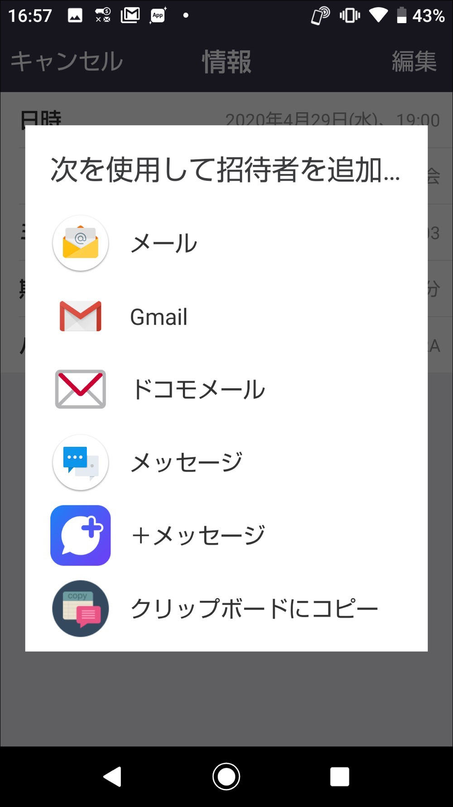

参加者に招待状を送る方法を選択して招待状を発信しましょう。各アイコンをタップすると各アプリが起動しますのでそこから参加者へ送信してください。

当日は会議が自動的に始まるわけではないので、主催者も参加者と同じようにZoomにログインし、参加者の受け入れ作業をする必要があります。