# Zoom使い方ガイド iOS版

[Zoom](https://zoom.us/){:target="_blank" :rel="noreferrer"}の無料プランを使ってオンラインミーティングを開催してみましょう。

※無料プランはグループミーティングが40分に制限されています。

このページではiOSアプリで解説しています。

* パソコンの方は[こちら](ZoomMeeting.md)
* Androidの方は[こちら](android.md)

を参照してください。

## 条件
* インターネットに接続されていること
* iOS(バージョン8以降)
* 本体付属のカメラとマイク (イヤホン端子またはブルートゥース接続のイヤホン・マイクなど)

## Zoomのアプリをインストールする
Zoomのアプリをインストールしておくと便利なので、まずはお使いのデバイスにアプリをインストールしましょう。

[App Storeからのインストールはこちら](https://itunes.apple.com/us/app/id546505307){:target="_blank" :rel="noreferrer"}
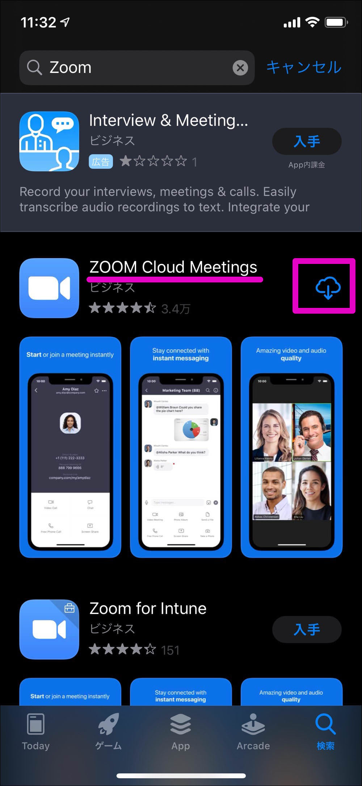
アプリを確認したら `入手` または `雲マーク` をタップしてインストールします。

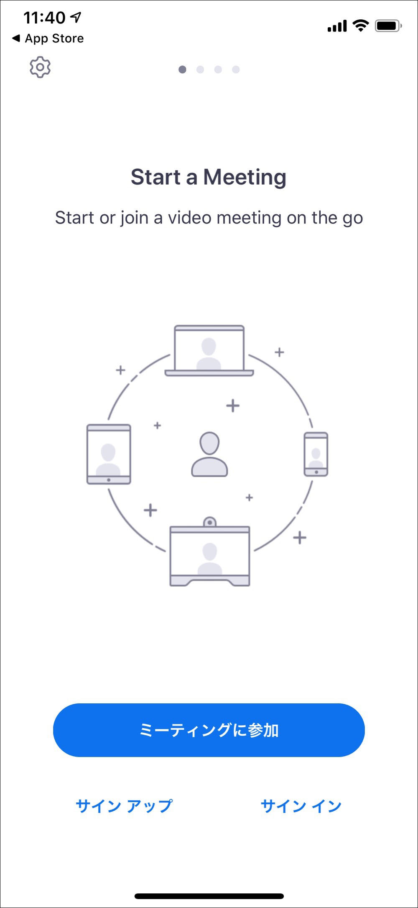
インストールが完了して `開く` をタップするとZoomアプリが起動します。ここまで確認できれば一端アプリを終了してOKです。

## ミーティングに参加する
### 招待リンクからミーティングに参加

主催者から届いた招待メール(または各種チャットアプリ)を開き、`Zoomミーティングに参加する`と書かれたリンクをクリックします。

Zoomアプリが起動し、カメラ使用の確認メッセージが出るので `OK` をタップします。

カメラの使用を許可すると、内蔵カメラでの表示に切り替わります。続けて `ビデオ付き` で参加をタップし、主催者からの参加承認が出るまで待ちます。

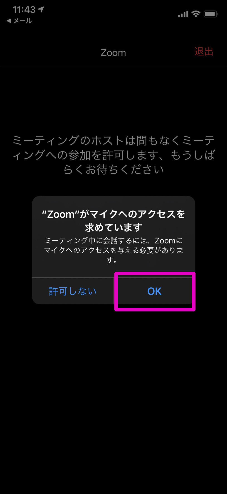

次にマイクの使用確認メッセージが出るので同じように `OK` をタップします。

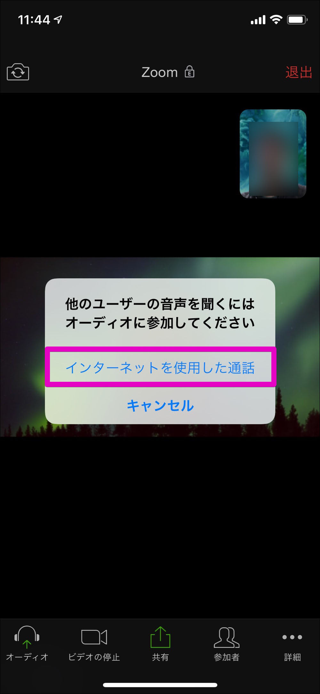
`インターネットを使用した通話`をタップします。

これでZoomミーティングへの参加が完了しました。

### ミーティングから退出する方法
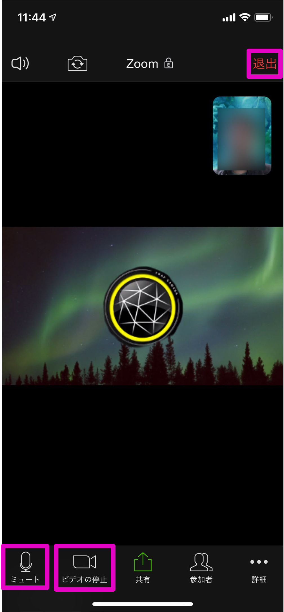
画面のドコでもいいのでタップすると、画面上部と下部にボタンが表れます。画面右上の `退出` をタップします。

また左下の `ミュート` 、`ビデオの停止`をタップすると一時的に音声やカメラのオン/オフの切り替えが可能です。

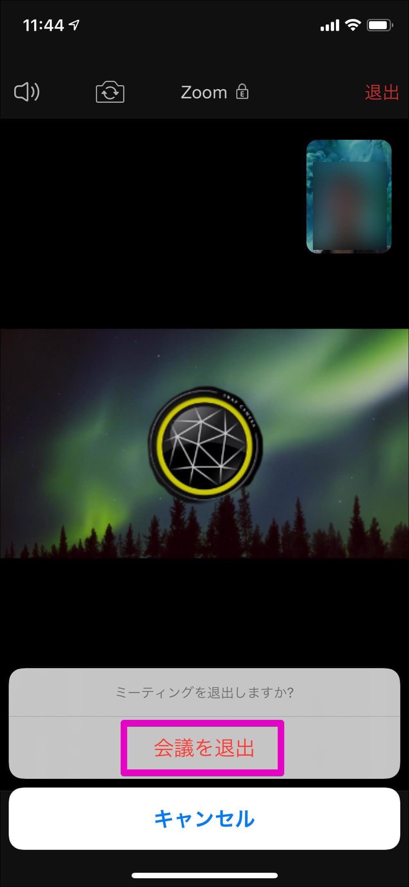
確認メッセージが出るので `会議を退出` をタップします。これで退出できたので、アプリを終了します。

## スマホアプリからミーティングを予約する
団委員会など、開催日が決まっている場合はスマホアプリから会議予約をしておきましょう。予約をしておけば予め参加者に通知を送ることができ、スムーズにミーティングに誘導できます。

iPhoneまたはiPadでZoomアプリほ起動します。アプリにログインが必要なのでログインしていなければログインしてください。

ログインができたら `スケジュール` をタップします。

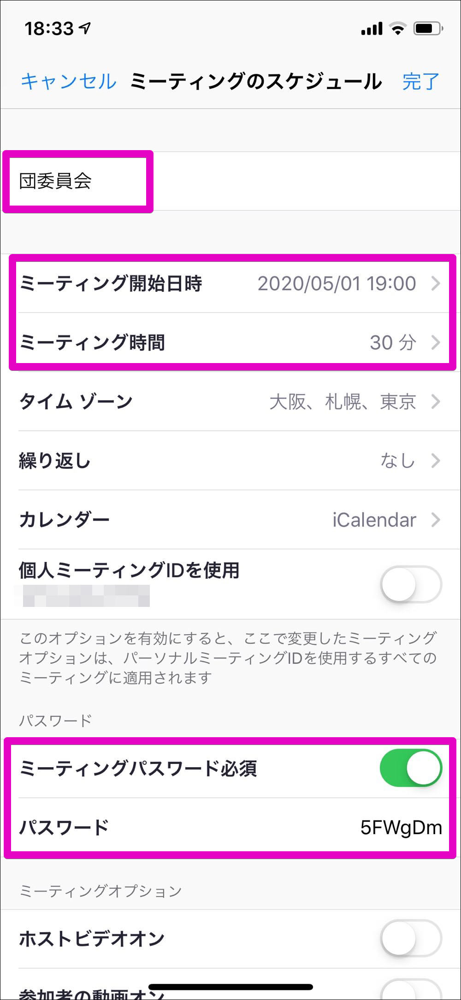
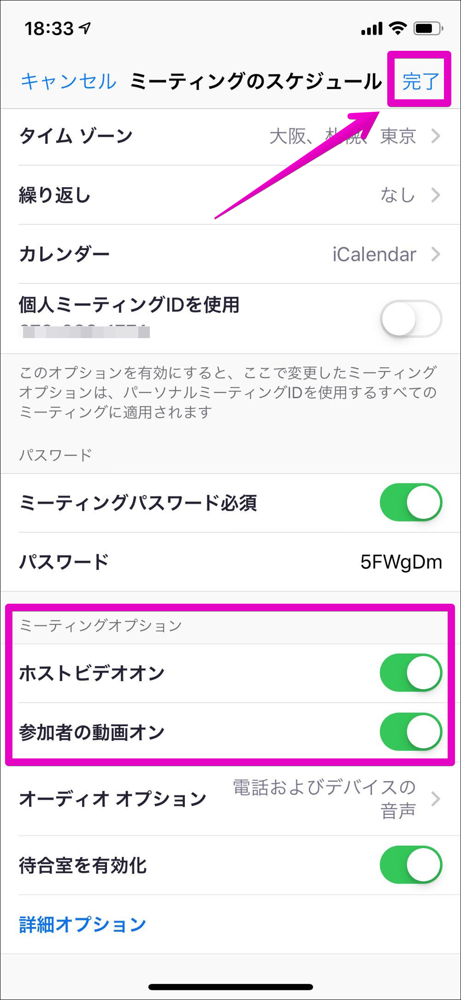
会議の予約画面になります。ここでは、

* 会議名
* 日時
* パスワード(必ず設定しましょう！)
* ミーティングオプション

などを設定します。ここまで設定できたら右上の `完了` をタップします。

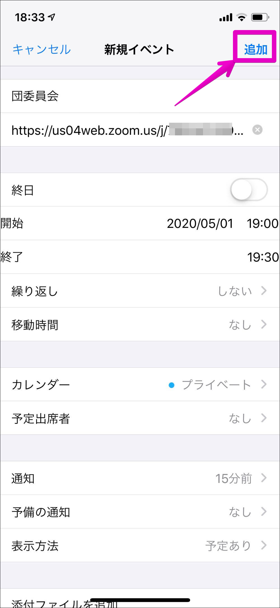
確認画面になります。設定内容を確認して問題なければ右上の `追加` をタップします。

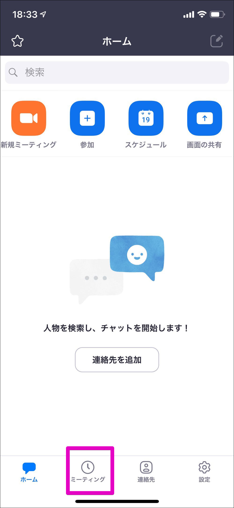
元の画面に戻ります。画面下部の `ミーティング` をタップします。

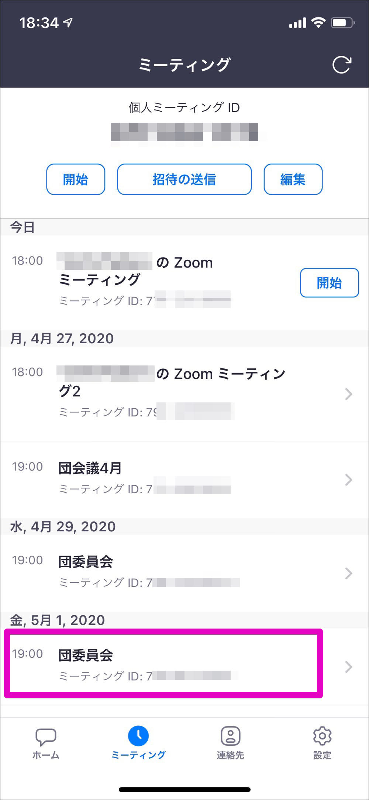
ここには設定済みのミーティングが表示されます。先程設定した"団委員会"をタップしてみましょう。

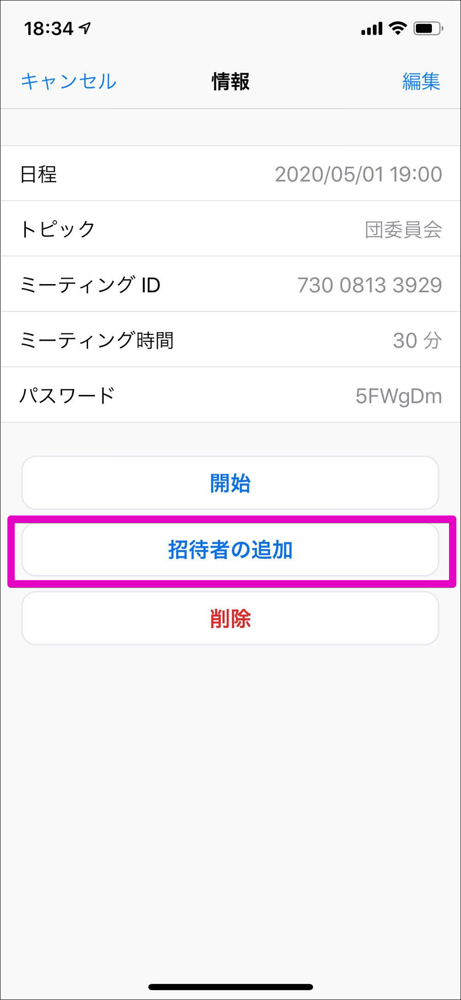
団委員会のミーティング詳細が表示されます。ここではミーティングの確認や修正をできます。修正が必要な場合は右上の `編集` をタップして行います。

問題がなければ参加者に招待状を送りましょう。画面下部の `招待者を追加` をタップします。

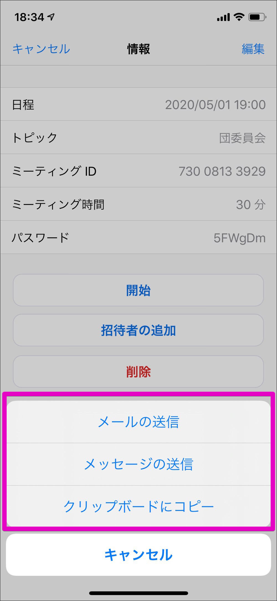
送る方法が表示されるので選択します。

* メールの送信
	* iPhone標準のメールアプリから招待状を送信します
* メッセージの送信
	* SMSやiMessageで招待状を送信します
* クリップボードにコピー
	* クリップボードへ招待状の中身がコピーされます。その他のアプリなどで送信する場合はこれを選択します

当日は会議が自動的に始まるわけではありません。主催者も参加者と同じくZoomにログインし、参加者の受け入れ作業をする必要があります。