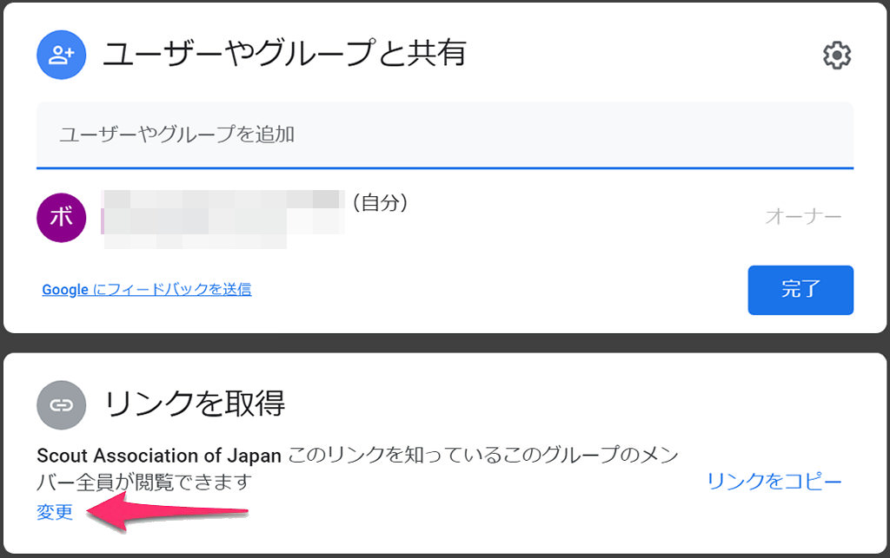
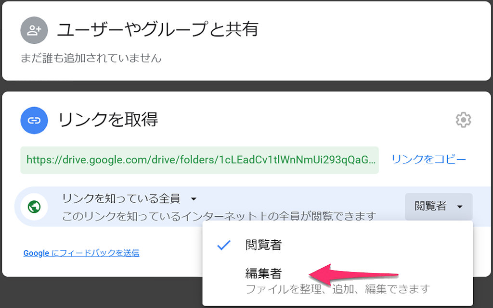

# Googleドライブでファイル共有をしてみよう
Googleドライブを使用するとファイルをインターネット上の領域に保存して、さまざまな端末で開いたり編集したりできます。仲間内で共有もできるので団委員会や団会議などで活用も期待できます。

# 導入ステップ
* [使用条件](#使用条件)
* [どういうシーンで使うと便利?](#どういうシーンで使うと便利?)
* [デメリットは?](#デメリットは?)
* [共有フォルダを作成する](#共有フォルダを作成する)
	* [googleドライブにアクセス](#googleドライブにアクセス)
	* [共有フォルダを作成](#共有フォルダを作成)
	* [ファイルのアップロード](#ファイルのアップロード)
	* [フォルダを共有](#フォルダを共有)
		* [共有リンクの注意!!](#共有リンクの注意!!)
	* [権限を変更](#権限を変更)
		* [権限設定はどうしたらいい?](#権限設定はどうしたらいい?)
	* [案内メールを送信](#案内メールを送信)

## 使用条件
* インターネットに接続されていること
* Googleアカウントにログインしていること
	* 無償アカウントの場合は容量制限が15GBです

## どういうシーンで使うと便利?
* 会議やプロジェクトなど複数人で使用する資料をまとめておきたい
* 外出先や複数のデバイスでファイルが見たい
* メールの添付ファイルにうんざりしている(最新のファイルがどれだかわかりにくい)

## デメリットは?
* インターネットに接続していないと使えない(オフラインで使う方法もあります)
* 誰かが誤操作でファイルを消してしまう可能性がある
* 共有設定に気をつける必要がある

デメリットはありますが、それを上回る便利さがあるので早速活用してみましょう。

# 共有フォルダを作成する
## googleドライブにアクセス

ブラウザで[drive.google.com](https://drive.google.com/)にアクセスします。この時点でGoogleアカウントにログインをしていなければ`Googleドライブにアクセス`をクリックしてGoogleアカウントにログインしてください。

アカウントにログイン後、googleドライブにアクセスするとこのような画面になります。

## 共有フォルダを作成
早速共有フォルダを作ってみましょう。上図の`新規`をクリックして

`フォルダ`を選択します。

`フォルダ名`を入力して`作成`をクリックします。

 フォルダができました! フォルダ名をダブルクリックして開いてみましょう。

## ファイルのアップロード
 フォルダはまだ空っぽなので何もありません。既存のPDFファイルをアップロードしてみましょう。図中の`ここにファイルをドロップ`にアップロードしたいPDFファイルをドラッグ&ドロップで放り込んでみましょう。

 ファイルがアップされて・・・

 ファイルがアップされました! ファイルサイズや個数によって時間がかかる場合がありますので、右下の完了ステータスメッセージを確認するといいかもしれません。

## フォルダを共有
 このままでは自分しか見られないのでフォルダの共有設定をしてみましょう。図中のフォルダ名の右隣にある`▼`をクリックしてサブメニューから`共有`を選択します。

 `リンクをコピー`をクリックするとクリップボードに共有アドレスがコピーされます。この共有アドレスをメールやチャットなどで共有相手に伝えればファイル共有が可能になります。

### 共有リンクの注意!!
* `リンクを知っている全員が閲覧可`は文字通り誰でも見られる状態です。SNSなどの公開の場に書き込んでしまうと思わぬトラブルのもとになりますので、共有リンクを通知する際は確実な方法でお伝えすることを推奨します。
* また共有メンバー内でのルール周知も大切なことですので、併せてご注意ください。

## 権限を変更
上図の設定では共有相手にファイルを見てもらうことは可能ですが新規にアップロードしてもらったり、編集してもらったりすることができないので、編集権限を変更してみましょう。

 `リンクを知っている全員が閲覧可▼`をクリックすると選択肢が出てきます。ここで`リンクを知っている全員が編集可`を選択してみましょう。

 するとフォルダの共有方法が`リンクを知っている全員が編集可`に切り替わりました。これで共有相手もファイルをアップロードしたり、ファイルを編集したりできるようになりました。

* 編集権限を編集(例: `閲覧可`から'編集可'など)しても共有リンクは変更されません(再度共有相手にリンクを通知する必要はありません)

### 権限設定はどうしたらいい?
|使用用途|権限設定|
|---|---
|ファイルのアップロードと編集は自分のみ|**リンクを知っている全員が閲覧可**
|ファイルのアップロードと編集をみんなでやりたい|**リンクを知っている全員が編集可**

## 案内メールを送信
 共有設定ウィンドウの下部にあるセクションからは、共有相手に直接案内状を送信することができます。

1. メンバーを追加(メールアドレス)
2. コメントを適宜入力
3. 送信

これでお使いのgmailから共有フォルダの案内メールを送信することができます。

# 終わりに
web会議や複数人でのプロジェクトに活用できるファイル共有方法をご紹介しました。メールに添付される大量のファイルにうんざりしていたり、「添付ファイルの最新版ってどこだっけ・・・」などのお悩みがあれば、ぜひ活用してみてください。

# 日本連盟DX推進室
「こんなことが知りたい」「これってどうやるの?」などありましたら <dx@scout.or.jp>までお寄せください。
