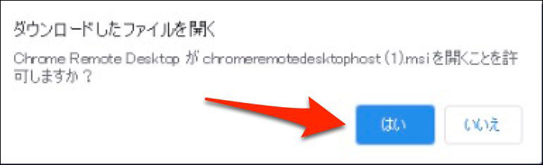

# リモートデスクトップって何?
リモート デスクトップを使うと、パソコンやモバイル デバイスからインターネット経由で、他のパソコンにあるファイルやアプリケーションにアクセスできます。
## こんなことに使えます
* 「パソコンのトラブル発生! ちょっと助けて欲しい!」
* 遠隔地のパソコンを操作したい

などなど

## どれを使えば良い? お薦めは?
リモートデスクトップの種類を説明して **Chrome リモート デスクトップ**をお薦めする

# Chrome リモート デスクトップを使ってみよう
**Chrome リモート デスクトップ**を使うとインターネットを介して他のパソコンにアクセスすることができます。

## Google Chromeのインストール
パソコンにGoogle Chromeがインストールされていない場合は[ここ](https://www.google.com/intl/ja_jp/chrome/)にアクセスしてGoogle Chromeをインストールしてください。

## リモートアクセスの設定
インストールしたGoogle Chromeを起動して、アドレスバーに`remotedesktop.google.com/access`と入力してEnterキーを押します。

*_リモートアクセスを使用するにはGoogle アカウントが必要です。既にアカウントを取得している場合はログインをしてください。未取得の場合は作成してください。_*

### アプリケーションのダウンロード

このような画面になるのでアイコンをクリックしてアプリケーションをダウンロードします。

別画面がポップアップするので[Chromeに追加]をクリックします。

[拡張機能を追加]をクリックします。

拡張機能がインストールされたら×でウィンドウを閉じます。

元の画面に戻ったら「同意してインストール」をクリックします。

ダウンロードが完了するとこのようなウィンドウがポップアップするので「はい」をクリックします。

インストールの途中でこのような画面になります。使用しているパソコンの名前が入力されているかもしれませんが、判別しやすいように好きな名前に変更が可能です。

