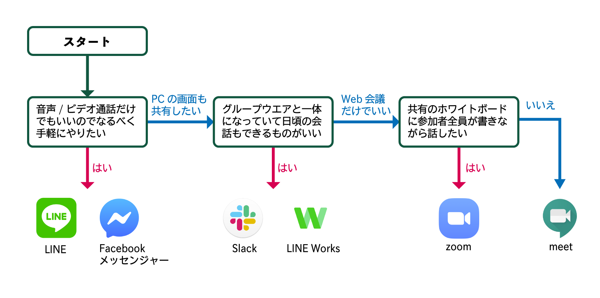

# どの会議ツールを選べばいいの？
会議ツールはビデオ通話ができるだけのものから画面共有やグループウエアと一体になっているものまで多種多様です。この記事では数多くの会議ツールの中からあなたにピッタリのツールをご紹介します。

# 各ツールの比較
|ツール名|価格|備考||
|---|---|---|---
|LINE|無料||[使い方(執筆中)]()
|Facebookメッセンジャー|無料||[使い方(執筆中)]()
|Slack|一部無料|無料プランではグループ通話不可|[使い方(執筆中)]()
|LINE Works|無料||[使い方(執筆中)]()
|zoom|一部無料|無料プランではグループ通話は1回40分限定|[使い方(執筆中)]()
|meet|無料||[使い方(執筆中)]()

※zoomは現在、いくつかのセキュリティ問題が発覚しています。ご利用はご自身の判断でお使いください。