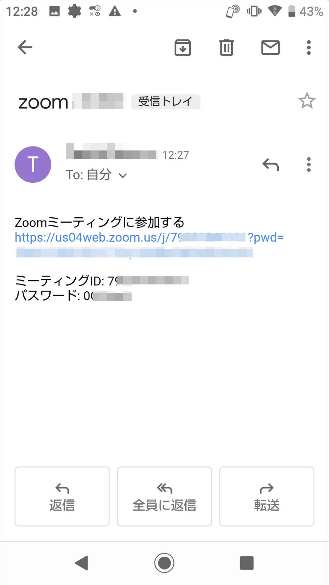

# Zoom使い方ガイド Android版

[Zoom](https://zoom.us/)の無料プランを使ってオンラインミーティングを開催してみましょう。

※無料プランはグループミーティングが40分に制限されています。

このページではAndroidアプリで解説しています。

* パソコンの方は[こちら](ZoomMeeting.md)
* iOSの方は[こちら](ios.md)

を参照してください。

# 条件
* インターネットに接続されていること
* Androidバージョン5以降のデバイス
* 本体付属のカメラとマイク (イヤホン端子またはブルートゥース接続のイヤホン・マイクなど)

# Zoomのアプリをインストールする
Zoomのアプリをインストールしておくと便利なので、まずはお使いのデバイスにアプリをインストールしましょう。

* [Playストアからインストールはこちら](https://play.google.com/store/apps/details?id=us.zoom.videomeetings)

[ここ](https://play.google.com/store/apps/details?id=us.zoom.videomeetings)を開くとPlayストアが開くので、アプリ名を確認して`インストール`をタップします。

インストールが完了したら`開く`をタップします。

Zoomのアプリが起動しました。ここまで確認できたらアプリは一端終了してください。

# ミーティングに参加する
## 招待リンクからミーティングに参加

主催者から届いた招待メール(または各種チャットアプリ)を開き、`Zoomミーティングに参加する`と書かれたリンクをクリックします。

Zoomアプリを開く確認画面が現れますので`zoom`をタップして、更に`常時`をタップします。

ここで参加者名を入力します。主催者や他の参加者かにわかりやすい名前を入力するといいと思います。

主催者から参加が承認されて、ミーティングに参加することができました。

マイクの使用確認が出たら`許可`をタップします。

カメラの使用確認が出たら`許可`をタップします。

画面のどこかをタップすると、各種のボタンを表示出来ます。左下の`ミュート`、`ビデオ`で音声やカメラを一時的に解除、再接続をすることができます。

## 退出する方法

画面のどこかをタップし、右上の`退出`をタップします。

確認画面の`ミーティングを退出`をタップすると退出することができます。アプリを終了させてください。

# 日本連盟DX推進室
「こんなことが知りたい」「これってどうやるの?」などありましたら <dx@scout.or.jp>までお寄せください。
