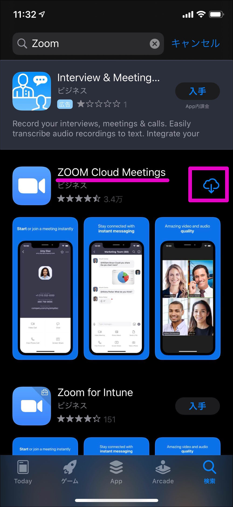
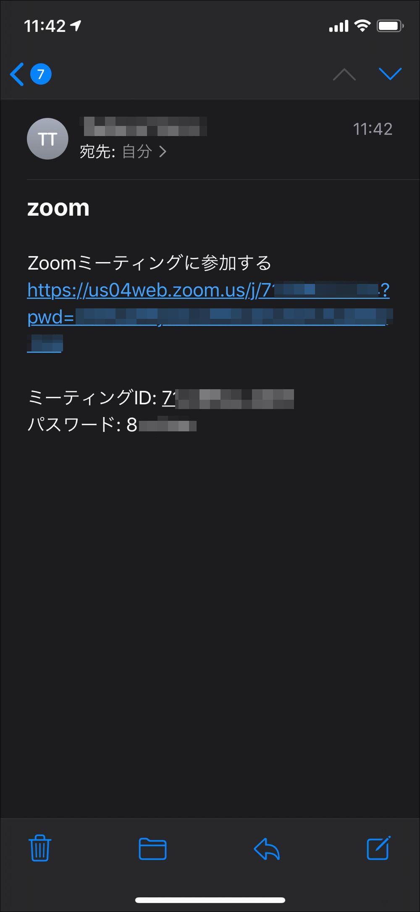
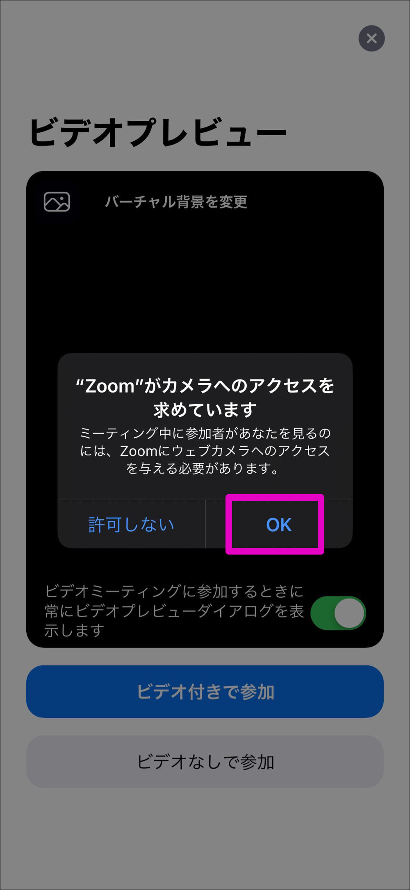
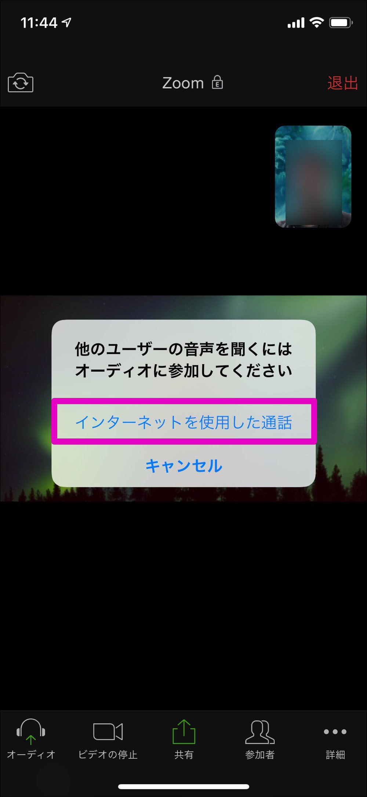
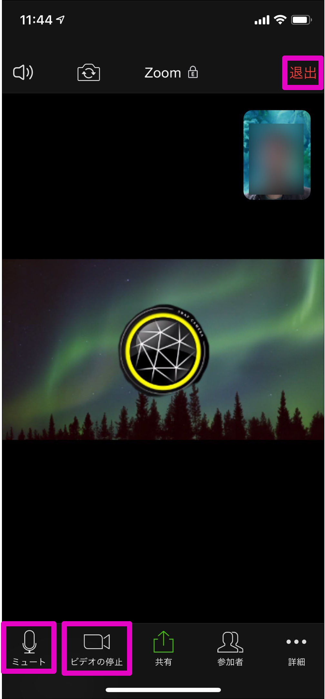
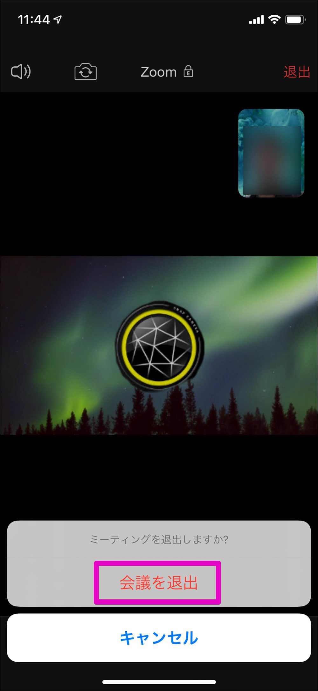

# Zoom使い方ガイド iOS版

[Zoom](https://zoom.us/)の無料プランを使ってオンラインミーティングを開催してみましょう。

※無料プランはグループミーティングが40分に制限されています。

このページではiOSアプリで解説しています。

* パソコンの方は[こちら](ZoomMeeting.md)
* Androidの方は[こちら](android.md)

を参照してください。

# 条件
* インターネットに接続されていること
* iOS(バージョン8以降)
* 本体付属のカメラとマイク (イヤホン端子またはブルートゥース接続のイヤホン・マイクなど)

# Zoomのアプリをインストールする
Zoomのアプリをインストールしておくと便利なので、まずはお使いのデバイスにアプリをインストールしましょう。

[App Storeからのインストールはこちら](https://itunes.apple.com/us/app/id546505307)

アプリを確認したら`入手`または`雲マーク`をタップしてインストールします。

インストールが完了して`開く`をタップするとZoomアプリが起動します。ここまで確認できれば一端アプリを終了してOKです。

# ミーティングに参加する
## 招待リンクからミーティングに参加

主催者から届いた招待メール(または各種チャットアプリ)を開き、`Zoomミーティングに参加する`と書かれたリンクをクリックします。

Zoomアプリが起動し、カメラ使用の確認メッセージが出るので`OK`をタップします。

カメラの使用を許可すると、内蔵カメラでの表示に切り替わります。続けて`ビデオ付き`で参加をタップし、主催者からの参加承認が出るまで待ちます。

次にマイクの使用確認メッセージが出るので同じように`OK`をタップします。

`インターネットを使用した通話`をタップします。

これでZoomミーティングへの参加が完了しました。

## ミーティングから退出する方法

画面のドコでもいいのでタップすると、画面上部と下部にボタンが表れます。画面右上の`退出`をタップします。

また左下の`ミュート`、`ビデオの停止`をタップすると一時的に音声やカメラのオン/オフの切り替えが可能です。

確認メッセージが出るので`会議を退出`をタップします。これで退出できたので、アプリを終了します。

# 日本連盟DX推進室
「こんなことが知りたい」「これってどうやるの?」などありましたら <dx@scout.or.jp>までお寄せください。
