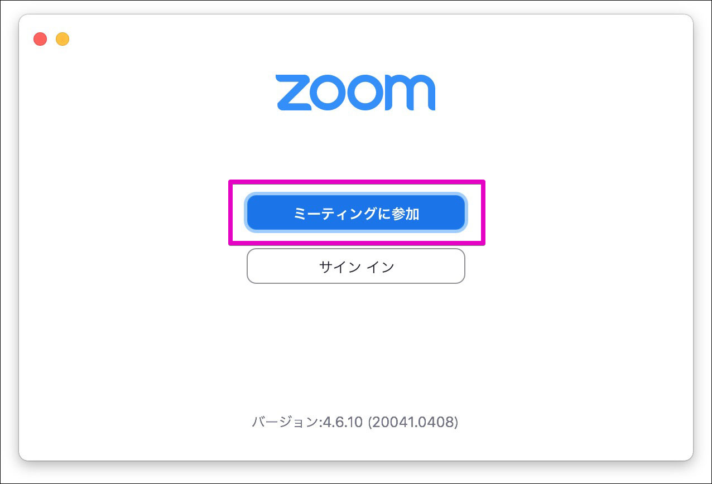
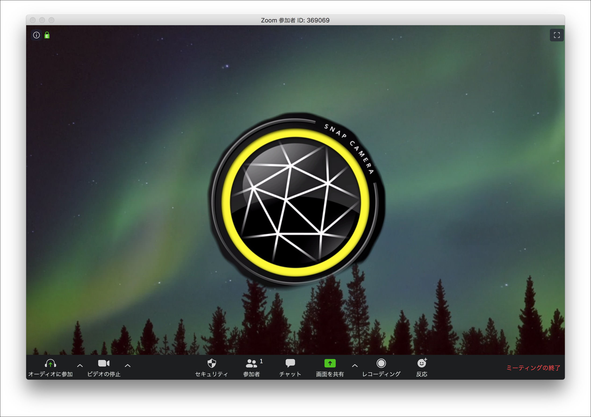
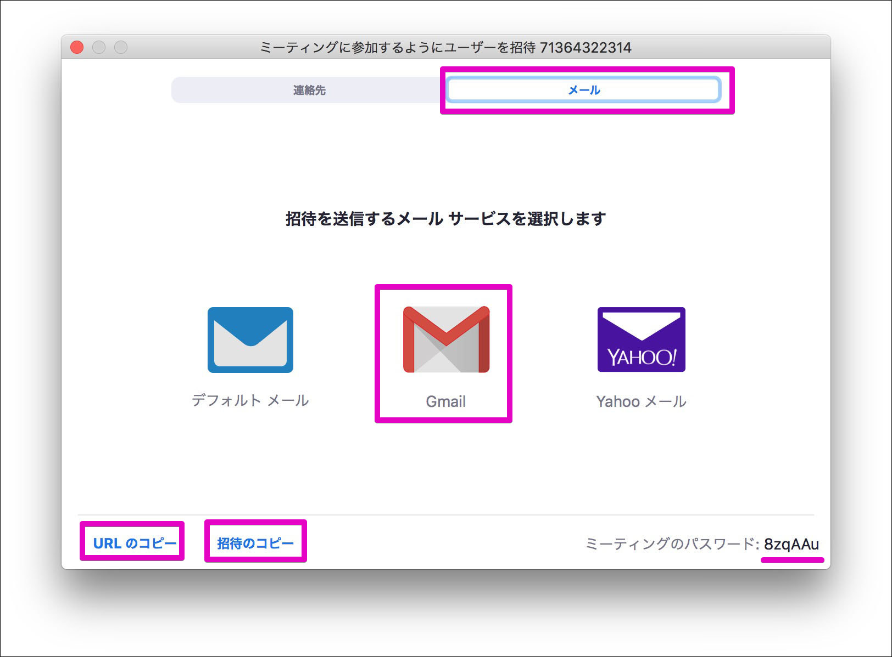

[Zoom](https://zoom.us/)の無料プランを使ってオンラインミーティングを開催してみましょう。

※無料プランはグループミーティングが40分に制限されています。

# このページで解説していること
* [条件](#条件)
* [Zoomのアプリをインストールする](#Zoomのアプリをインストールする)
* [使い方ガイドについて](#使い方ガイドについて)
* [ミーティングに参加する](#ミーティングに参加する)
	* [招待リンクからミーティングに参加](#招待リンクからミーティングに参加)
	* [手動でミーティングへ参加する方法](#手動でミーティングへ参加する方法)
		* [会議IDと名前の入力](#会議IDと名前の入力)
		* [パスワード](#パスワード)
* [ミーティングを開催する](#ミーティングを開催する)
	* [今すぐミーティングを開催する](#今すぐミーティングを開催する)
		* [ミーティングの開始](#ミーティングの開始)
		* [参加者の招待](#参加者の招待)
		* [参加者の承認](#参加者の承認)

# 条件
* インターネットに接続されていること
* パソコンまたはタブレット、スマートフォン
* 本体付属のカメラとマイク(もしくは外部接続のカメラ、マイクも可)

# Zoomのアプリをインストールする
Zoomのアプリをインストールしておくと便利なので、まずはお使いのデバイスにアプリをインストールしましょう。

* パソコン(windowsやMacなど)は[こちら](https://us04web.zoom.us/download#client_4meeting)
* iOS(iPhoneやiPad)は[こちら](https://itunes.apple.com/us/app/id546505307)
* Androidは[こちら](https://play.google.com/store/apps/details?id=us.zoom.videomeetings)

それぞれお使いのデバイスにあったZoomアプリケーションをインストールしてください。

# 使い方ガイドについて
このページではパソコン版アプリで解説しています。

* iOS(iPhoneまたはiPad)の方は[こちら](ios.md)
* Androidの方は[こちら](android.md)

を参照してください。

# ミーティングに参加する
## 招待リンクからミーティングに参加

インストールが完了するとこのような画面が起動します。(自動的に起動しない場合は、手動で起動させてください)

主催者から届いた招待メール(または各種チャットアプリ)を開き、`Zoomミーティングに参加する`と書かれたリンクをクリックします。

webブラウザが起動し、Zoomアプリら開く確認画面が現れますので`zoom.usを開く`をクリックします。

`コンピューターオーディオに参加する`をクリックし、主催者から参加の承認が出るまで待ちます。以上でミーティングへ参加することができます。

リンクから入れない場合は、会議IDとパスワードを手入力することで会議へ参加できますので以下の方法を参照してください。

## 手動でミーティングへ参加する方法

会議IDとパスワードを手入力してミーティングに参加する場合はZoomアプリを起動し、`ミーティングに参加`をクリックします。

### 会議IDと名前の入力

主催者から届いたミーティング案内に書いてある`会議ID`(11桁の数字)を入力します。(ハイフンなしで入力してもOKです)

他の参加者があなたを識別しやすくなるように`お名前`を入力し、`参加`をクリックします。

###パスワード

案内に書いてあるパスワードを入力し`参加`をクリックします。主催者から参加の承認がされると、ミーティングへ参加することができます。

# ミーティングを開催する

## 今すぐミーティングを開催する

### ミーティングの開始

Zoomアプリを起動し`新規ミーティング`をクリックします。

※ zoomアプリにログインしていない場合はログインが必要です

`コンピューターオーディオで参加`をクリックすると会議の開催が完了します。

### 参加者の招待

画面下部にある`参加者`アイコンをクリックすると、画面右に参加者ウィンドが現れます。

`招待`ボタンをクリックします。

このような画面に遷移しますので上部の`メール`タブを開きます。各ボタン(リンク)では以下の方法で参加者へ招待を送ることができるので使い分けてください。

* Gmail
	* お使いのGmailアカウントから直接招待メールを送信することができます。必要事項が記載された状態で新規メールが作成されるので、送信先を入力するだけで済むので便利です。
* URLのコピー
	* `https://us04web.zoom.us/j/7**********?pwd=SGNJZFRjd3krdVMvSlo3elA4U25EQT09`のようなリンク**だけ**がクリップボードにコピーされます。メールやメッセージ、チャットなどに貼り付けて参加者に案内を送信します。
* 招待のコピー
	* 以下のような招待文がクリップボードにコピーされます。メールやメッセージ、チャットなどに貼り付けて参加者に案内を送信します。

> Zoomミーティングに参加する
> 
> https://us04web.zoom.us/j/7**********?pwd=SGNJZFRjd3krdVMvSlo3elA4U25EQT09
> 
> ミーティングID: 713 6432 2314
> 
> パスワード: 8zqAAu

## 参加者の承認

参加者がミーティングへの参加リクエストがあった場合、主催者として受け入れて続きをします。画面右の参加者ウィンドに`X待機中`と表示が現れます。

主催者は氏名等を確認し、`許可する`をクリックすると参加者がミーティングへ参加することができます。氏名で確認することしかできないため、坂者には判別しやすい名前を付けてもらうようにしましょう。

`削除する`をクリックするとミーティングへの参加を拒否することができます。

## ミーティングを予定する
会議等が予定されている場合はミーティングを予約しておくとスムーズに進められるので便利です。Zoomアプリから「次の団委員会開催予約」をしてみましょう。

Zoomアプリから`スケジュール`をクリックします。

ミーティングの設定画面が出てきます。

* トピック
	* 会議の名称などを入力します
* 日付
	* 会議の日時を設定します
* パスワード
	* 必ず設定しましょう
* ビデオ
	* 参加形態によって設定を変更してください
* オーディオ
	* 参加形態によって設定を変更してください
* カレンダー
	* ご使用の環境で選択してください

ここまで設定できたら`スケジュール`をクリックします。これでミーティングの予約が完了しました。

Zoomアプリに戻り、`ミーティング`タブをクリックします。すると先程予約したミーティングが設定されているのが確認できます。

予約したミーティングをクリックすると詳細が見られます。`招待のコピー`をクリックすると招待に必要な文面がクリップボードにコピーされるので、メールやチャットで参加者に周知します。

# 日本連盟DX推進室
「こんなことが知りたい」「これってどうやるの?」などありましたら <dx@scout.or.jp>までお寄せください。
